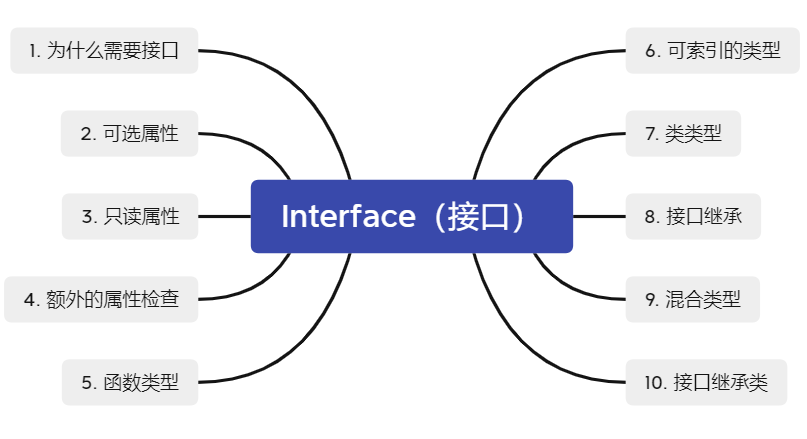

# TypeScript Interface




## 1. 为什么需要接口

> * **Program to an interface, not an implementation.**
> * **基于接口编程，而非实现编程。**

* 从本质上来看，**接口**就是一组**协议**或者**约定**，是功能提供者给使用者的一个**功能列表**；
* 将接口和实现相分离，**封装不稳定的实现，暴露文档的接口**；
* **越抽象、越顶层、越脱离具体某一实现的设计，越能提高代码的灵活性，越能应对未来的需求变化**；
* 当某个功能只有一种实现方式，未来也不可能被其他实现方式替换，那我们就没有必要为其设计接口。

* TS 的核心原则之一是**对值所具有的结构进行类型检查**；

* TS 里，接口的作用是**为这些类型命名和为你的代码或第三方代码定义契约**。

  ```ts
  // 未使用接口
  function printLabel (labelledObj: {label: string}) {
      console.log(labelledObj.label)
  }
  
  printLabel({label: 'Size 10 Object'})
  
  // 使用接口
  interface LabelledValue {
      label: string;
  }
  
  function printLabel (labelledObj: LabelledValue) {
      console.log(labelledObj.label)
  }
  
  printLabel({label: 'Size 10 Object', size: 10}) // 这里会报错
  ```


## 2. 可选属性

> 接口里的属性不全是必需的。有些只在某些条件下存在，或者根本不存在。

```ts
interface SquareConfig {
    color?: string;
    width?: number;
}
```


## 3. 只读属性

> 一些对象属性只在对象刚刚创建的时候修改其值。

* `readonly` 修饰符
* `ReadonlyArray<T>` 类型

```ts
// readonly
interface Point {
    readyonly x: number;
	readyonly y: number;
}

// ReadonlyArray<T>
let a: number[] = [1, 2, 3, 4]
let ro: ReadonlyArray<number> = a

a = ro;  // error
a = ro as number[];  // ok
```


* `readonly` 和 `const` 的区别

  > 从用法出发，作为**变量使用**的话用 `const`，作为**属性使用**则用 `readonly`。


## 4. 额外的属性检查

```ts
interface SquareConfig {
    color?: string;
    width?: number;
}

function createSquare (config: SquareConfig): {color: string, area: number} {
    //...
}

let mySquare = createSquare({ colour: 'red', width: 100 })  // error
```


> **对象字面量**会经过**额外的属性检查**，当将它们赋值给变量或作为参数传递的时候，如果一个对象字面量存在任何**目标类型**不包含的属性时，会报错。

* 规避检查的方法：

  * 类型断言

    ```ts
    let mySquare = createSquare({ width: 100, opacity: 0.5 } as SquareConfig)
    ```

  * 将对象字面量赋值给一个变量

    ```ts
    let myObj = {colour: 'red', width: 100}
    let mySquare = createSquare(myObj)
    ```

  * 给接口添加一个字符串索引签名

    ```ts
    interface SquareConfig {
        color?: string;
        width?: number;
        [propName: string]: any;
    }
    ```

    


## 5. 函数类型

> 调用签名：它就像是一个只有参数列表和返回值类型的函数定义。

```ts
interface SearchFunc {
    (source: string, subString: string): boolean;
}
```


* 函数的参数名不需要与接口里定义的名字相同；
* 函数的参数名也可以不指定类型。


## 6. 可索引的类型

```ts
interface StringArray {
    [index: number]: string;
}

interface NotOkay {
    [x: number]: Animal;  // error
    [x: string]: Dob;
}

interface NumberDictionary {
    [index: string]: number;
    length: number;
    name: string;  // error
}
```


## 7. 类类型

> 通过**实现接口**来强制一个类去符合某种锲约。

```ts
interface ClockInterface {
    currentTime: Date;
    setTime(d: Date);
}

class Clock implements ClockInterface {
    currentTime: Date;
    
    setTime (d: Date) {
        this.currentTime = d;
    }
    
    constructor(h: number, m: number) {}
}
```


* 注意：在类类型中区分**类静态部分**与**类实例部分**。


## 8. 接口继承

> 一个接口可以继承多个接口，创建出多个接口的合成接口。

```ts
interface Shape {
    color: string;
}

interface PenStroke {
    penWidth: number;
}

interface Square extends Shape, PenStroke {
    sideLength: number;
}
```


## 9. 混合类型

```ts
interface Counter {
    (start: number): string;
	interval: number;
	reset (): void;
}
```


## 10. 接口继承类

> 当接口继承了一个类类型时，它会继承类的成员但不包括其实现。