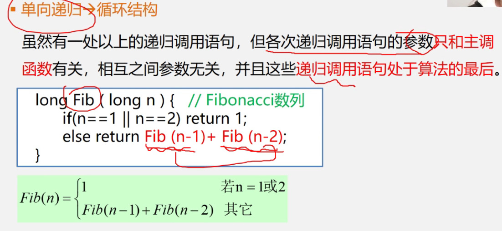
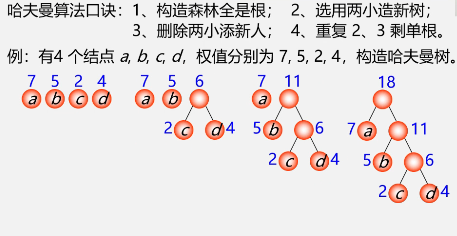
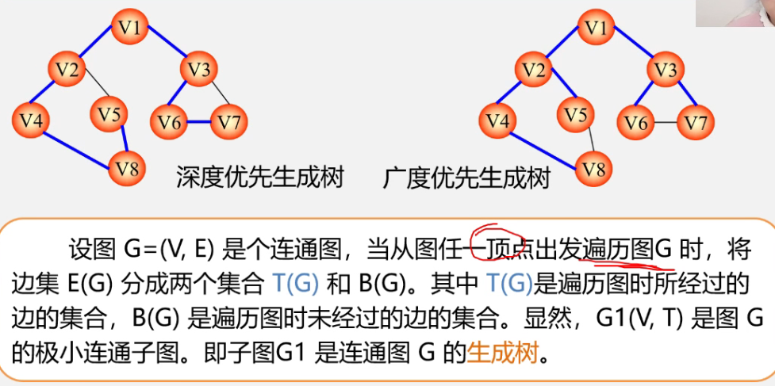

# 数据结构


## 0. 算法分析

* 在算法满足基本**设计要求**时，主要通过**算法的效率**高低来评判不同算法的优劣程度。算法效率分为**时间效率**和**空间效率**。现实中通常采用**事前分析**法来估算算法的时间效率。通过计算**语句频度**实现事前分析。**O(f(n))** 为**算法的渐进时间复杂度**，O （Order）是数量级的符号，简称**时间复杂度**。

* 分析算法时间复杂度的基本方法：

  1. 找出**语句频度最大**的那条语句作为基本语句

  2. 计算**基本语句**的频度得到问题规模 n 的某个函数 f(n)

  3. 取其数量级用符号 O 表示

* ```c
  i = 1;
  while (i < n) 
      i = i * 2;
  
  // 时间复杂度
  // T(n) = O(logn)
  ```

* 最坏时间复杂度、平均时间复杂度和最好时间复杂度

* 时间复杂度 T(n) 按数量级递增顺序为：

  1. 常数阶 O(1)
  2. 对数阶 O(logn)
  3. 线性阶 O(n)
  4. 线性对数阶 O(n logn)
  5. 平方阶 O(n^2)
  6. 立方阶 O(n^3)
  7. K 次方阶 O(n^k)
  8. 指数阶 O(2^n)

* 算法的空间复杂度

  * 算法本身要占据的空间，输入/输出、指令、常数、变量等
  * 辅助空间

* 数据结构：逻辑结构、存储结构和数据的运算（索引、排序、插入、删除、修改等）


## 1. 线性表

* **线性表**：具有相同特性的数据元素的一个有限序列。

  * 顺序存储结构

  * 链式存储结构

  * 基本操作：
    * InitList
    * ClearList
    * DestroyLIst
    * ListEmpty
    * ListLength
    * GetElem(L, i, &e)
    * LocateElem(L, e, compare())
    * PriorElem(L, cur_e, &pre_e)
    * NextElem(L, cur_e, &next_e)
    * ListInsert(&L, i, e)
    * ListDelete(&L, i, &e)
    * ListTraverse(&L, visited())


### 1.1 顺序表

* 线性表的**顺序存储**表示：逻辑上相邻，物理存储上也相邻。
  * LOC(a<sub>i+1</sub>)  = LOC(a<sub>i</sub>) + l
  * LOC(a<sub>i+1</sub>)  = LOC(a<sub>i</sub>) + (i - 1) * l
  * 顺序表中的元素地址连续、依次存放、随机存取、类型相同。
  * 【算法】顺序表的查找
  * 【算法】顺序表的插入
  * 【算法】顺序表的删除
  * 顺序表的优点：存储密度大、可随机存取表中任一元素；顺序表缺点：在插入、删除某一元素时，需要移动大量元素，浪费存储空间，属于静态存储形式，数据元素的个数不能自由扩充。


### 1.2 链表

* 线性表的**链式存储**表示：用一组物理位置任意的存储单元来存放线性表的数据元素。链表中的逻辑次序和物理次序不一定相同。

  * 术语：

    * 结点：数据域 + 指针域（一个或两个）
    * 链表：单链表、双链表、循环链表
    * 头指针：指向链表中的第一个节点的指针
    * 首元结点：链表中存储第一个数据元素的结点
    * 头结点：链表的首元结点之前附加的一个结点

  * 特点：

    * 结点在存储器中的位置是任意的
    * 链表只能顺序存取

  * 单链表的定义和表示：

    ```c
    typedef struct Lnode { // 声明结点的类型和指向结点的指针类型
        ElemType data; // 结点的数据域
        struct Lnode *next; // 结点的指针域
    } Lnode, *LinkList // LinkList 为指向结构体 Lnode 的指针类型
        
    // 定义链表L
    LinkList L;
    
    // 定义结点指针p
    Lnode *p;   <==>  LinkList p;
    
    ```

  * 单链表的基本操作

    * 【补充算法】单链表的创建（初始化）

    * 【补充算法】单链表的销毁：从头指针开始，依次释放所有结点

    * 【补充算法】清空单链表：链表仍存在，但链表中无元素，成为空链表

    * 【补充算法】求链表的表长

    * 【算法】取单链表中第 i 个元素的内容（顺序存取）

    * 【算法】按值查找

      > * 根据指定数据获取该数据所在的位置 / 位置序号
      > * 算法时间效率：O(n)

    * 【算法】插入

      > * 在第 i 个结点前插入值为 e 的新结点
      > * 算法时间效率：O(1) / O(n)

    * 【算法】删除第 i 个结点

      > * 算法时间效率：O(1) / O(n)

    * 【算法】建立单链表

      > * 头插法 / 前插法：
      > * 从最后一个结点开始，依次将各结点插入到链表的前端
      > * 尾插法 / 后插法：
      > * 新建一个尾指针，每插入一个元素尾指针向后移一位

  * 循环链表

    > * 尾指针不为空，而是指向头结点
    >
    > * 循环链表中没有 NULL 指针，判断是否等于头指针

  * 双向链表

    > * 在单链表的每个结点里再增加一个指向其直接前驱的指针

    * 双向循环链表
    * 【算法】双向链表的插入
    * 【算法】双向链表的删除

* 链式存储结构的优点

  * 结点空间可动态申请和释放
  * 插入和删除时不需要移动数据元素

* 链式存储结构的缺点

  * 存储密度小，每个结点的指针域需要占用额外的存储空间

    > 存储密度 = 结点数据本身占用的空间 / 结点占用的空间总量

  * 非随机存取，增加了算法的时间复杂度


### 1.3 对比

* 顺序表和链表的适用情况：

  * 顺序表适合表长变化不大的按元素位置序号访问数据元素的情况
  * 链表适合长度变化较大的频繁进行插入或删除操作的情况

### 1.4 应用

* 【算法】线性表的应用：

  * 线性表的合并

    > La = (7, 5, 3, 11)  Lb = (2, 6, 3)  ==>  la = (7, 5, 3, 11, 2, 6)

  * 有序表的合并

    > 合并两个非递减有序表(顺序表 / 链表)
    >
    > La = (1, 7, 8)  Lb = (2, 4, 6, 8, 10, 11)  ==>  Lc = (1, 2, 4, 6, 7, 8,  8, 10, 11)


## 2. 栈和队列

> 栈和队列是限定插入和删除只能在表的**端点**进行的**线性表**

### 2.1 栈

> * 后进先出（LIFO）
> * 栈（stack）是仅在**表尾**进行插入、删除操作的线性表

* 栈顶，即 a<sub>n</sub> 端

* 栈底，即 a<sub>1</sub> 端

* 入栈 / 压栈，PUSH(x)

* 出栈 / 弹栈，POP(y)

* 案例：

  * 进制转换

  * 括号匹配的检验

    

  * 表达式求值（经典栈应用案例）

* 操作：

  * InitStack(&S)
  * DestroyStack(&S)
  * StackEmpty(S)
  * StackLength(S)
  * GetTop(S, &e)
  * ClearStack(&S)
  * Push(&S, e)
  * Pop(&S, &e)

#### 2.1.1 顺序栈

* 使用数组作为顺序栈存储方式的特点：
  * 简单、方便但是容易产生溢出
  * 上溢，overflow
  * 下溢，underflow

#### 2.1.2 链栈

* 链栈是运算受限的单链表，只能在链表头部进行操作
* 结点的指针域指向前一个元素

#### 2.1.3 栈与递归

* 递归定义：

  * 若一个对象部分地包含它自己，或用它自己给自己定义，则称这个对象是递归的（单链表的定义）。
  * 若一个过程**直接或间接地调用自己**，则称这个过程是递归的过程。

* 递归场景：

  * 递归定义的数学函数 -- 阶乘
  * 具有递归特性的数据结构  --  二叉树、广义表
  * 可递归求解的问题  --  迷宫问题、Hanoi 汉诺塔问题

* 递归问题：

  * 用分治法求解：对于复杂问题，能够分解成几个相对简单的且解法相同或类似的子问题来求解。

  * 必备的三个条件：

    * 能够将一个问题转换成一个新问题
    * 可以通过转化使问题简化
    * 必须有一个明确的递归出口，或称**递归的边界**

  * **基本项、归纳项**

    ```c
    long Fact(long n) {
        if (n == 0) return 1;	// 基本项
        else return n * Fact(n - 1);	// 归纳项
    }
    ```

* 栈与递归（递归工作栈）

  

* 递归的优缺点：

  * 优点：结构清晰、程序宜读
  * 缺点：时间开销大

* 递归程序转换成非递归程序：

  * **尾递归、单向递归  -->  循环结构**

    * 【算法】阶乘

      

    * 【算法】斐波那契数列

      

      

  * 自用**栈**模拟系统的运行栈


### 2.2 队列

> * 先进先出（FIFO）
> * 队列（queue）仅在**表尾**插入，在**表头**删除

* 队首，即 a<sub>1</sub> 端
* 队尾，即 a<sub>n</sub> 端
* 案例：
  * 舞伴问题

#### 2.2.1 顺序队列

* 循环队列（解决假上溢的方法）

  

* 循环队列判断队空还是队满：少用一个元素空间

  

#### 2.2.2 链式队列


## 3. 串、数组和广义表

### 3.1 串

> * 串（String），零个或多个任意**字符组成的有限序列**
> * S = "a<sub>1</sub>a<sub>2</sub>...a<sub>n</sub>"

* 子串、主串、字符位置、子串位置（**子串第一个字符**在主串中的位置）、空格串（由一个或多个空格组成的串）、串相等（长度相同和对应位置上的字符都相同）
* 案例：
  * DNA 序列比对
* 操作：
  * StrAssign(&T, chars)
  * StrCompare(S, T)
  * StrLength(S)
  * Concat(&T, S1, S2)
  * SubString(&Sub, S, pos, len)
  * StrCopy(&T, S)
  * StrEmpty(S)
  * ClearString(&S)
  * **Index(S, T, pos)**
  * Replace(&S, T, V)
  * StrInsert(&S, pos, T)
  * StrDelete(&S, pos, len)
  * DestroyString(&S)

#### 3.1.1 顺序串

#### 3.1.2 链式串

> 块链结构

* 可以将多个字符放在一个结点中（块）

#### 3.1.3 串的匹配

* 串的模式匹配算法

  > 确定主串中所含子串（模式串）第一次出现的位置

* 【算法】种类

  * **BF 算法**（Brute-Force），穷举法。从主串的每一个字符开始依次与子串进行匹配。
  * KMP 算法

### 3.2 数组

#### 3.2.1 二维数组

* 格式：数据类型  变量名称[行数] [列数];

### 3.3 广义表


## 4. 树和二叉树

### 4.1 树

* 基本术语：
  * 根结点
  * 度：结点拥有的子树个数
  * 叶子（终端结点）
  * 树的高度
  * **有序树**：树中结点的各子树从左至右有次序。
  * **无序树**：树中结点的各子树无次序。
  * 森林：m (m >= 0) 棵互不相交的树的集合。

### 4.2 二叉树

> 关于树的复杂问题都可以转换成二叉树解决

* 定义：二叉树是 n (n >= 0) 个结点的有限集，它或者是空集 (n = 0)，或者是由一个根结点及两个互不相交的分别称作这个根的**左子树**和**右子树**的二叉树组成。

* 特点：

  * 每个结点最多有俩孩子

  * **子树分左右**

  * **二叉树不是树的特殊情况**

    

* 二叉树的 5 种基本形态：

  

* 案例：

  * 数据压缩问题
  * 利用二叉树求解表达式的值


#### 4.2.1 二叉树的性质

1. 在二叉树的第 i 层上至多有 2<sup>i - 1</sup> 个结点（i > = 1）
2. 深度为 k 的二叉树至多有 2<sup>k - 1</sup> 个结点（k >= 1）
3. 对任何一颗二叉树 T，如果其叶子数为 n<sub>0</sub>，度为 2 的结点数为 n<sub>2</sub>，则 n<sub>0</sub> = n<sub>2</sub> + 1


#### 4.2.2 满二叉树

#### 4.2.3 完全二叉树


* 性质：
  * 具有 n 个结点的完全二叉树的深度为 log<sub>2</sub>n 的对数的底 + 1
  
  

### 4.3 遍历二叉树

#### 4.3.1 先序遍历

* DLR：
  1. 访问根结点
  2. 先序遍历左子树
  3. 先序遍历右子树


#### 4.3.2 中序遍历

* LDR：
  1. 中序遍历左子树
  2. 访问根结点
  3. 中序遍历右子树
* **中序遍历的非递归算法**


#### 4.3.3 后序遍历

* LRD：
  1. 后序遍历左子树
  2. 后序遍历右子树
  3. 访问根结点


#### 4.3.4 层次遍历

> 二叉树的层次遍历**使用队列实现**


#### 4.3.5 应用

* 【算法】二叉树的建立

  > * 使用先序遍历生成二叉树
  > * ABC##DE#G##F###

  

* 【算法】复制二叉树

* 【算法】计算二叉树深度

* 【算法】计算二叉树结点总数

* 【算法】计算二叉树叶子结点总数


### 4.4 线索二叉树


### 4.5 树和森林

> 树和森林是可以相互转换的

* 树的存储结构：

  1. 双亲表示法，每个结点含两个域（数据域和双亲域）

  2. 孩子链表

  3. 孩子兄弟表示法

     > * 又称二叉树表示法、**二叉链表**表示法
     > * 链表中每个结点的两个指针域分别指向其**第一个孩子结点**和**下一个兄弟结点**

     

* 树和二叉树的转换

  > 通过**二叉链表**实现

  * 树转换成二叉树：
    1. 兄弟相连留长子
  * 二叉树转换成树：
    1. 左孩右右连双亲
    2. 去掉原来右孩线

  

* 森林和二叉树的转换
  * 森林转换成二叉树：
    1. 树变二叉根相连
  * 二叉树转换成森林：
    1. 去掉全部右孩线，孤立二叉再还原


* 树和森林的遍历
  * 树的遍历：
    1. 先根（次序）遍历
    2. 后根（次序）遍历
    3. 层次遍历
  * 森林的遍历


### 4.6 哈夫曼树

> * 最优二叉树
> * 带权路径长度（WPL）最短的树

* 概念：
  * 路径
  * 结点的路径长度
  * 树的路径长度
  * 权（weight）：将树中结点赋给一个有着某种含义的数值，则称这个数值为该结点的权
  * 结点的带权路径长度：从根结点到该结点之间的路径长度与该结点的权的乘积
  * 树的带权路径长度（WPL）：树中所有叶子结点的带权路径长度之和


* 构造哈夫曼树：

  1. 构造森林全是根
  2. 选用两小造新树
  3. 删除两小添新人
  4. 重复 2 、3 剩单根

  


#### 4.6.1 哈夫曼编码


## 5. 图


* 术语：
  * 顶点
  * 边
  * **无向图**
  * **有向图**
  * 完全图
  * 稀疏图
  * 稠密图
  * **网：有权图**
  * 邻接
  * 关联
  * 顶点的度
  * 路径
  * 路径长度
  * 回路（环）
  * 简单路径
  * 简单回路（简单环）
  * 连通图（强连通图）
  * 权与网：图中边或弧所具有的相关数称为权。表明从一个顶点到另一个顶点的距离或耗费。带权的图称为网。
  * 子图
  * 连通分量（强连通分量）
  * 极小连通子图
  * 生成树
  * 生成森林

### 5.1 图的表示

1. 数组（**邻接矩阵**）表示法
   * **无向图**的邻接矩阵是**对称**的
   * **有向图**顶点的出度为第 i 行元素之和，入度为第 i 列元素之和
2. **邻接表**表示法（链式）
   * 邻接表不唯一


### 5.2 深度优先遍历

* DFS 算法
* **稠密图**适合在邻接矩阵上进行深度优先遍历
* **稀疏图**适合在邻接表上进行深度优先遍历


### 5.3 广度优先遍历

* BFS 算法


### 5.4 最小生成树

* 生成树

  > 所有顶点都连通，且没有环路

* 深度优先生成树

* 广度优先生成树

  

* **最小生成树**

  > 给定一个无向网络，在该网的所有生成树中，使得**各边权值之和最小**的那棵生成树称为该网的**最小生成树**，也叫**最小代价生成树**

  * 应用：

    * n 个城市之间建立道路

  * **构造最小生成树：**

    > Minimum Spanning Tree（**MST 性质**）


#### 5.4.1 普里姆（Prim）

* 【算法】思想：选择点
* 时间复杂度：O(n^2)
* 适应范围：稠密图

#### 5.4.2 克鲁斯卡尔（Kruskal）

* 【算法】思想：选择边
* 时间复杂度：O(eloge) （e 为边）
* 适应范围：稀疏图


### 5.5 最短路径

#### 5.5.1 迪杰斯特拉（Dijkstra）

> 单源最短路径【算法】

#### 5.5.2 佛洛依德（Floyd）

> 所有顶点间的最短路径【算法】


### 5.6 拓扑排序

* **有向无环图**：无欢的有向图，简称 DAG 图

#### 5.6.1 AOV 网

* 应用：
  1. 排课表
* **拓扑排序**
  * 检测 AOV 网中是否存在环


### 5.7 关键路径

#### 5.7.1 AOE 网

* 关键活动
* 关键路径


## 6. 查找

* 概念：
  * 查找表
  * 静态查找表
  * 动态查找表
  * **平均查找长度（ASL）**

### 6.1 线性表的查找

#### 6.1.1 顺序查找

* 带哨兵的顺序查找【算法】
  * 时间复杂度：O(n)

#### 6.1.2 折半查找

* 非递归算法

  

* 递归算法

  

* 折半查找的性能分析：**判断树**

* 时间复杂度：O(logn)
* 缺点：需要查找表中的元素按序存储

  

#### 6.1.3 分块查找

* **索引顺序表的查找**
  * 时间复杂度：O(logn) ~ O(n)

* 对比：

  |          |     顺序查找     | 折半查找 |     分块查找     |
  | :------- | :--------------: | :------: | :--------------: |
  | ASL      |       最大       |   最小   |       中间       |
  | 表结构   |  有序表、无序表  |  有序表  |     分块有序     |
  | 存储结构 | 顺序表、线性链表 |  顺序表  | 顺序表、线性链表 |

  

### 6.2 树表的查找

#### 6.2.1 二叉排序树

* 性质：
  1. **二叉排序树的左子树比根小，右子树比根大**
  2. 中序遍历非空的二叉排序树所得到的数据元素序列是一个按关键字排列的**递增有序**序列
* 操作：
  1. 查找
  2. 插入
  3. 生成（利用插入完成）
  4. 删除（有三种情况）
* 时间复杂度：O(logn) ~ O(n)
* **查找性能最好的二叉树是平衡二叉树**


#### 6.2.2 平衡二叉树

> * 又称 AVL 树
> * 一颗平衡二叉树是具有下列性质的二叉排序树：
>   1. 左子树与右子树的高度之差的绝对值小于等于1
>   2. 左子树和右子树也是平衡二叉排序树

* 平衡因子（BF） = 结点左子树的高度 - 结点右子树的高度
* 失衡二叉树的调试：
  * 失衡结点：不止一个失衡结点时，为最小失衡子树的根节点
  * 失衡类类型：
    1. LL 型
    2. LR 型
    3. RL 型
    4. RR 型


#### 6.2.3 红黑树

#### 6.2.4 B-树

#### 6.2.5 B<sup>+</sup> 树

#### 6.2.6 键树


### 6.3 散列表

* 基本思想：记录的存储位置与关键字之间存在对应关系（**hash 函数**）

* 术语：

  * 散列方法（杂凑法）
  * 散列函数（杂凑函数）
  * 散列表（杂凑表）
  * 冲突：不同的关键码映射到同一个散列地址
  * 同义词

* **散列函数的构造方法**：

  * 直接定址法

  * **除留余数法**

    > * Hash(key) = key mod p
    > * 如何选取合适的 p？技巧：设表长为 m，取 p <= m 且为**质数**

* **处理冲突的方法**：

  * 开放定址法（开地址法）
    * 线性探测法
    * 二次探测法
    * 伪随机探测法
  * 链地址法（拉链法）


## 7. 排序

* 存储结构

  


### 7.1 分类

* 按存储介质分为：

  * 内部排序：数据量不大、数据在内存，无需内外存交换数据
  * 外部排序：数据量较大、数据在外存（文件排序）

* 按比较器个数分为：

  * 串行排序：单处理机
  * 并行排序：多处理机

* 按主要操作分为：

  * 比较排序：用比较的方法

    > 插入排序、交换排序、选择排序、归并排序

  * 基数排序：不比较元素大小，仅根据元素本身的取值确定其有序位置


### 7.2 插入排序

* 基本思想

  

  > 在有序序列中插入一个元素，保持序列有序，有序长度不断增加

#### 7.2.1 直接插入排序

> 顺序法定位插入位置

* 思想：

  

  


* 【算法】：

  


#### 7.2.2 二分插入排序

> 二分法定位插入位置

* 【算法】：

  

  

#### 7.2.3 希尔排序

> 缩小增量多遍插入排序

* 思想：

  


* 【算法】：

  


### 7.3 交换排序

* 思想：两两比较，如果发生逆序则交换，直到所有记录都排好序为止。

#### 7.3.1 冒泡排序

* 思想：每趟不断将记录两两比较，并按**前小后大**规则交换

* 规律：假设有六个元素，第 1 趟需要比较 5次、第 2 趟需要比较 4 次、第 3 趟需要比较 3 次...

* 总结：n 个记录，总共需要 n - 1 趟。假设当前趟数为 m ，每趟需要比较 n - m 次。

* 【冒泡排序算法】：

  

* 【改进的冒泡排序算法】：

  


#### 7.3.2 快速排序

* 思想：任取一个元素为**中心**；所有比它**小**的元素一律往前放，比它**大**的元素一律往后放，形成**左右两个子表**；对各子表重新选择中心元素并**依次规律调整**；直到每个子表的元素**只剩一个**

  

* 解法：双指针

  

* 【算法】：

  

  

  


### 7.4 选择排序

#### 7.4.1 直接选择排序

#### 7.4.2 堆排序


### 7.5 归并排序


## 8. 力扣刷题

### 8.1 数组

#### 8.1.1 二分查找

* 非递归法1 -- 左闭右闭法
* 非递归法2 -- 左闭右开法
* 递归法


#### 8.1.2 移除元素

* 暴力破解法

  

* 双指针法

  


### 8.2 链表

#### 8.2.1 移除链表元素
