## 0. 前言

* 答题思路：题目  -->  知识点  -->  解答


## 2. JavaScript

### 2.1 变量类型

#### 2.1.1 值类型和引用类型的区别

> 为什么值类型和引用类型的存储和拷贝规则不一样：简单理解，值类型一般占用的内存空间比较小，采用值复制的情况不会损失太多性能；但是引用类型通常占用的内存空间都比较大，采用值拷贝的话速度会比较慢，影响性能。

* 值类型：

  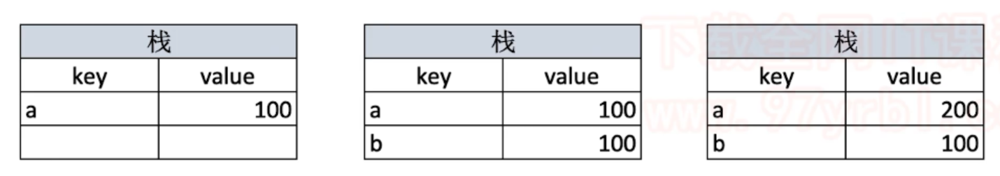

* 引用类型：

  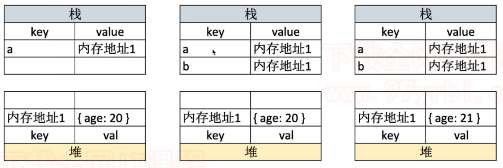


#### 2.1.2 typeof 操作符

> typeof 操作符可以判断所有的**基本数据（值）类型**，可以判断**函数（function）类型**，但是会将所有的**引用类型**都判断为 **object**。


#### 2.1.3 深拷贝

```javascript
function deepClone(obj = {}) {
    if (typeof obj !== 'object' || obj == null) {
        return obj
    }
    
    let result = null
    if (obj instanceOf Array) {
        result = []
    } else {
        result = {}
    }
    
    for (let key in obj) {
        if (obj.hasOwnProperty(key)) {
            result[key] = deepClone(obj[key])
        }
    }
    
    return result
}
```


### 2.2 变量计算

#### 2.2.1 字符串拼接

```js
const a = 100 + 10  // 110
const b = 100 + '10'  // '10010'
const c = true + '10'  // 'true10'
```


#### 2.2.2 == 和 === 运算符

* **除了 == null 之外，其他一律使用 === 运算符**

* 原因：

  ```js
  const obj = { x: 100 }
  
  if (obj.a == null) {}
  /**
   * 相当于
   * if (obj.a === null || obj.a === undefined) {}
  *
  ```


#### 2.2.3 if 语句和逻辑运算

* **truly 变量**：`!!a === true` 的变量

* **falsely 变量**：`!!a === false` 的变量

* ```js
  // 以下都是 falsely 变量，除此以外都是 truly 变量
  !!0 === false
  !!NaN === false
  !!'' === false
  !!null === false
  !!undefined === false
  !!false === false
  ```

* ```js
  10 && 0  // 0
  '' || 'abc'  // 'abc'
  console.log(!window.abc)  // true
  ```

  

  

#### 2.2.4 隐式类型转换

> why [] == ![] ？

类似标题中的问题还有很多，例如：

> **为什么 [ ] == false 而 !![ ] == true** ？

or

> **[1] == [1] 是true 还是 false**？

如果对 **==** 操作符一知半解，就很难解答类似的问题。我们直接开门见山，看看==是如何工作的，这里的难点主要涉及到js中的隐式强制类型转换。

判断步骤如下：

1. 如果有一个操作数是布尔值，则在比较相等性之前先将其转换为数值----false转换为0，而true转换为1。
2. 如果一个操作数是字符串，另一个操作数是数值，在比较相等性之前先将字符串转换为数值。
3. 如果一个操作数是对象，另一个操作数不是，则调用对象的valueOf()方法，如果得到的值不是基本类型值，则基于返回值再调用toString方法（这个过程即ToPrimitive），用得到的基本类型值按照前面的规则进行比较。
4. 如果两个操作数都是对象，则比较他们是不是同一个对象。如果两个操作数指向同一个对象，则相等操作符返回true, 否则返回false。

这两个操作符在进行比较时则要遵循下列规则。

1. null 和 undefined 是相等的。
2. 要比较相等性之前，不能将null和undefined转换成其他任何值
3. 如果有一个操作数是NaN，则相等操作符返回false, 而不相等操作符则返回true, NaN != NaN

我画了一个图来表示这个过程：


根据上面的步骤，来分析[] == ![] 为什么会返回true

```
[] == ![]
```

!运算符的优先级大于 ==，所以实际上这里还涉及到!的运算。
这个比较简单！会将后面的值转化为布尔值。即![]变成!Boolean([]), 也就是!true,也就是false。

实际上是对比 `[] == false;`

运用上面的顺序，false是布尔值，所以转化为数值Number(flase), 为0。

对比`[] == 0;`

满足第三条规则[] 是对象（数组也属于对象），0不是对象。所以ToPrimitive([])是""

对比`"" == 0;`

满足第二条规则，"" 是字符串，0是数值，对比Number("") == 0, 也就是 0 == 0。

所以得出 `[] == ![]`

我们可以用同样的方法对上面提到的两个等式例子进行判断，都能得出结论。虽然过程有点麻烦，但是本质上就是将两边的比较值转化为数值进行比较。读者可以自行尝试实践。


### 2.3 原型和原型链

> * 如何准确判断一个变量是不是数组？
> * 手写一个简易的 jQuery，考虑插件和扩展性。
> * class 的原型本质，如何理解？


#### 2.3.1 class 和 继承

```js
// 父类
class People {
    constructor(name) {
        this.name = name
    }
    eat() {
        console.log(`${this.name} eat something`)
    }
}

// 子类
class Student extends People {
    constructor(name, number) {
        super(name)
        this.number = number
    }
    sayHi() {
        console.log(`姓名 ${this.name} 学号 ${this.number}`)
    }
}

// 子类
class Teacher extends People {
    constructor(name, major) {
        super(name)
        this.major = major
    }
    teach() {
        console.log(`${this.name} 教授 ${this.major}`)
    }
}

// 实例
const xialuo = new Student('夏洛', 100)
console.log(xialuo.name)
console.log(xialuo.number)
xialuo.sayHi()
xialuo.eat()

// 实例
const wanglaoshi = new Teacher('王老师', '语文')
console.log(wanglaoshi.name)
console.log(wanglaoshi.major)
wanglaoshi.teach()
wanglaoshi.eat()

```


#### 2.3.2 类型判断 - instanceof

```js
xialuo instanceof Student  // true
xialuo instanceof People  // true
xialuo instanceof Object  // true

[] instanceof Array  // true
[] instanceof Object  // true

{} instanceof Object  // true
```


#### 2.3.3 原型

> * 每个 **class** 都有**显示原型** `prototype`
> * 每个**实例**都有**隐式原型** `__proto__`
> * 实例的 `__proto__` 指向对应 clsss  的 `prototype`

```js
// class 实际上是函数，是语法糖
typeof People  // 'function'
typeof Student  // 'function'

// 隐式原型和显示原型
console.log(xialuo.__proto__)
console.log(Student.prototype)
console.log(xialuo.__proto__ === Student.prototype)
```

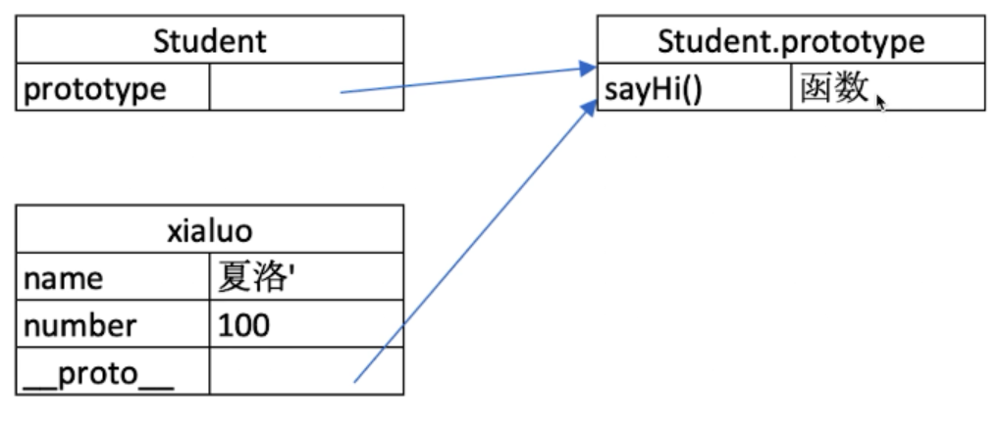


#### 2.3.4 原型链

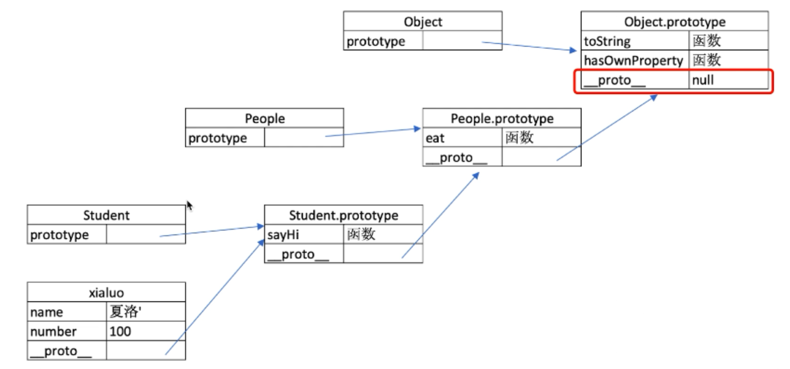


### 2.4 作用域与闭包

> * **this** 的不同应用场景，如何取值？
> * 手写 **bind** 函数
> * 实际开发中**闭包**的应用场景，距离说明


#### 2.4.1 作用域和自由变量

* 作用域

  > 表示的是一个变量的合法使用范围。

  * 分类：**全局作用域；函数作用域；块级作用域。**

* 自由变量：

  * 一个变量在当前作用域**没有定义**，但被使用了；
  * 向上级作用域，一层一层依次寻找，直至找到为止；
  * 如果到全局作用域都没找到，则报错 xx is not defined。


#### 2.4.2 闭包

> **所有自由变量的查找，都是在函数定义的地方，向上级作用域查找。不是在函数被执行的地方。**

* 函数作为返回值

  ```js
  function create() {
      const a = 100
      return function() {
          console.log(a)
      }
  }
  
  const fn = create()
  const a = 200
  
  fn()  // ??
  ```

  

* 函数作为参数被传递

  ```js
  function print(fn) {
      const a = 200
      fn()
  }
  
  const a = 100
  function fn() {
      console.log(a)
  }
  
  print(fn)  // ??
  ```


#### 2.4.3 this

> **this 的取值是在函数被执行时确认的，不是函数在定义的时候。**

* 作为普通函数

  ```js
  function fn1() {
     	console.log(this)
  }
  
  fn1()  // ??
  ```

  

* 使用 call、apply 和 bind

  ```js
  // call
  fn1.call( { x: 100 } )  // ??
  
  // bind
  const fn2 = fn1.bind( { x: 200 } )
  fn2()  // ??
  ```

  

* 作为对象方法被调用

  ```js
  const zhangsan = {
      name: '张三',
      sayHi() {
          console.log(this)  // ??
      },
      wait() {
          setTimeout(function() {
              console.log(this)  // ??
          })
      }
  }
  ```

  

* 在 class 方法中调用

  ```js
  class People {
      constructor(name) {
          this.name = name
          this.age = 20
      }
      sayHi() {
          console.log(this)
      }
  }
  
  const zhangsan = new People('张三')
  zhangsan.sayHi()
  ```

  

* 箭头函数

  ```js
  // 箭头函数中的 this 永远会取它上级作用域的 this 值
  const zhangsan = {
      name: '张三',
      sayHi() {
          console.log(this)  // ??
      },
      wait() {
          setTimeout(() => {
              console.log(this)  // ??
          })
      }
  }
  ```

  

#### 2.4.4 手写 bind 函数

* bind 原理

  ```js
  function fn1(a, b, c) {
    console.log('this', this);
    console.log(a, b, c);
  
    return 'this is fn1'
  }
  
  const fn2 = fn1.bind({x: 100}, 10, 20, 30)
  const res = fn2()
  
  console.log(res);  // ??
  ```

* 手写 bind

  ```js
  Function.prototype.customBind = function () {
      // 将参数拆解为数组
      const args = Array.prototype.slice.call(arguments)
      
      // 获取 this（数组第一项）
      const t = args.shift()
      
      // fn1.bind(...) 中的 fn1
      const self = this
      
      // 返回一个函数
      return function() {
          return self.apply(t, args)
      }
  }
  ```

  

  #### 2.4.5 实际开发中闭包的应用

  * 隐藏数据

  * cache 小工具

    ```js
    // 闭包隐藏数据，只提供 API
    function createCache() {
        const data = {}  // 闭包中的数据，被隐藏，不被外界访问
        
        return {
            set: function(key, val) {
                data[key] = val
            },
            get: function(key) {
                return data[key]
            }
        }
    }
    
    const c = createCache()
    c.set('a', 100)
    console.log(c.get('a'))  // 100
    ```

    

    

    

### 2.5 异步

> * 同步和异步的区别是什么？
> * 手写用 Promist 加载一张图片
> * 前端使用异步的场景有哪些？

#### 2.5.1 单线程与异步

* JS 是单线程语言，只能同时做一件事
* 浏览器和 nodejs 已经支持 JS 启动**进程**，如 Web Worker
* JS 和 DOM 渲染共用同一个线程，因为 JS 可修改 DOM 结构

```js
// 异步 不会阻塞代码执行
console.log(100)

setTimeout(() => {
    console.log(200)
}, 1000)

console.log(300)

// 同步 会阻塞代码执行
console.log(100)
alert(200)
console.log(300)
```


* 异步的应用场景
  * 网络请求
  * 图片加载
  * 定时任务


#### 2.5.2 Promise

```js
function loadImg(src) {
    return new Promise((resolve, reject) => {
        const img = document.createElement('img')
        img.onload = () => {
            resolve(img)
        }
        img.onerror = () => {
            reject(new Error(`图片加载失败 ${src}`))
        }
        img.src = src
    })
}
```


* 面试题：
  * Promise 构造函数中 resolve() 之后的代码会不会执行？ 会。


### 2.6 异步进阶

> * 请描述 event loop（事件循环/事件轮询）的机制
> * 什么是宏任务和微任务，两者有什么区别？
> * Promise 有哪三种状态？如何变化？

#### 2.6.1 event loop

> * JS 是单线程运行的
> * 异步要基于回调来实现
> * event loop 就是异步回调的实现原理

* event loop 过程

  * 同步代码，一行一行放在 Call Stack 执行

  * 遇到异步，会先“记录”下，等待时机（定时、网络请求等）

  * 时机到了，就移动到 Callback Queue

  * 如 Call Stack 为空（即同步代码执行完）Event Loop 开始工作

  * 轮询查找 Callback Queue，如有则移动到 Call Stack 执行

  * 然后继续轮询查找

    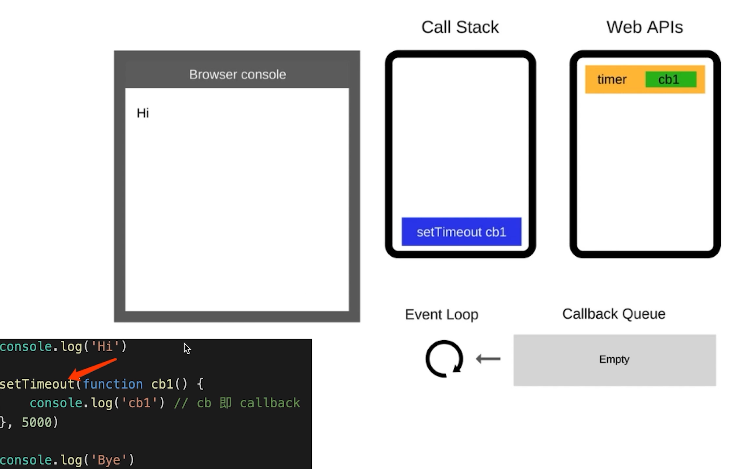


异步（setTimeout、ajax 等）使用回调，基于 event loop;

DOM 事件也使用回调，基于 event loop;


#### 2.6.2 Promise

* 三种状态
  * pending  resolved  rejected
  * pending -->  resolved / rejected
  * **状态的变化时不可逆的**

* 状态的表现：

  * pending 状态，不会触发 then 和 catch
  * **resolved 状态，会触发 then**
  * **rejected 状态，会触发 catch**

  

* then 和 catch 改变状态

  * **then 正常返回 resolved 状态的 promise，里面有报错则返回 rejected；**
  * **catch 正常返回 resolved 状态的 promise，里面有报错则返回 rejected。**


#### 2.6.3 async/await

> * Promise then catch 链式调用，也是基于回调函数
> * async/await 是用同步的语法来编写异步的代码

* async/await 和 Promist 的关系

  * **执行 async 函数，返回的是 Promist 对象；**

  * **await 相当于 Promise 的 then；**

  * **try..catch 可捕获异常，代替了 Promise 的 catch。**

    ```js
    // 执行 async 函数，返回的是 Promist 对象
    async function fn1() {
        return 100  // 相当于 return Promise.resolve(100)
    }
    
    const res1 = fn1()
    res1.then(data => {
        console.log('data', data)  // 100
    })
    
    // await 相当于 Promise 的 then
    !(async function() {
        const p1 = Promise.resolve(200)
        const data = await p1  // await 相当于 Promise 的 then
        console.lg('data', data)  // 200
    }
    )()
    
    !(async function() {
        const data = await 300  // 相当于 await Promise.resolve(300)
        console.log('data', data)  // 300
    })()
    
    !(async function() {
        const data = await fn1()
        console.log('data', data)  // 100
    })()
    
    // try..catch 可捕获异常，代替了 Promise 的 catch
    !(async function() {
        const p2 = Promise.reject('err')
        
        try {
            const res = await p2
            console.log(res)
        } catch(ex) {
            console.error(ex)
        }
    })()
    ```

    

    #### 2.6.4 面试题

    ```js
    Promise.resolve().then(() => {
        console.log(1)
        throw new Error('error')
    }).catch(() => {
        console.log(2)
    }).then(() => {
        console.log(3)
    })
    ```
    
    
    
    ```js
    async function async1() {
        console.log('async1 start')  // 当 async1 函数被执行时这里会被打印
        await async2()  // 会先去立马执行 async2 函数，然后再去执行 await 操作
        // await 的后面（不管有多少行），都可以看做是 callback 里内容，即异步！！
        console.log('asnyc1 end')
    }
    
    async function async2() {
        console.log('async2')
    }
    
    console.log('script start')
    async1()  // 会立马去执行 async1 函数体
    console.log('script end')
    
    // ??
    ```
    
    ```js
    async function fn() {
        return 100
    }
    
    !(async function() {
        const a = fn()  // ??  Promise!!
        const b = await fn()  // ??  100
    })()
    ```

    ```js
    !(async function() {
        console.log('start')
        const a = await 100
        console.log('a', a)
        const b = await Promise.resolve(200)
        console.log('b', b)
        const c = await Promise.reject(300)
        console.log('c', c)
        console.log('end')
    })()
    ```
    
    ```js
    console.log(100)
    
    setTimeout(() => {
        console.log(200)
    })
    
    Promise.resolve().then(() => {
        console.log(300)
    })
    
    console.log(400)
    ```
    
    ```js
    async function async1() {
        console.log('async1 start')
        await async2()
        console.log('async1 end')
    }
    
    async function async2() {
        console.log('async2')
    }
    
    console.log('script start')
    
    setTimeout(() => {
        console.log('setTimeout')
    }, 0)
    
    async1()
    
    new Promise((resolve) => {
        console.log('promise1')
        resolve()
    }).then(() => {
        console.log('promise2')
    })
    
    console.log('script end')
    ```


#### 2.6.4 for...of

> * for...in（以及 forEach 和 for）是常规的同步遍历
>
> * for...of 常用于异步的遍历

```js
function muti(num) {
    return new Promise(resolve => {
        setTimeout(() => {
            resolve(num * num)
        }, 1000)
    })
}

const nums = [1, 2, 3]

nums.forEach(async (i) => {
    const res = await muti(i)
    console.log(res)
})

!(async function() {
    for (let i of nums) {
        const res = await muti(i)
        console.log(res)
    }
})()
```


#### 2.6.5 宏任务和微任务

> * 宏任务（macroTask）：setTimeout，setInterval，Ajax，DOM 事件；
> * 微任务（microTask）：Promise，async/await
> * **微任务执行时机比宏任务要早**

* event loop 和 DOM 渲染

  * 每次 Call Stack 清空（即每次轮询结束），即同步任务执行完，
  * 都是 DOM 重新渲染的机会，DOM 结构如有改变则重新渲染，
  * 然后再去触发下一次 Event Loop。

  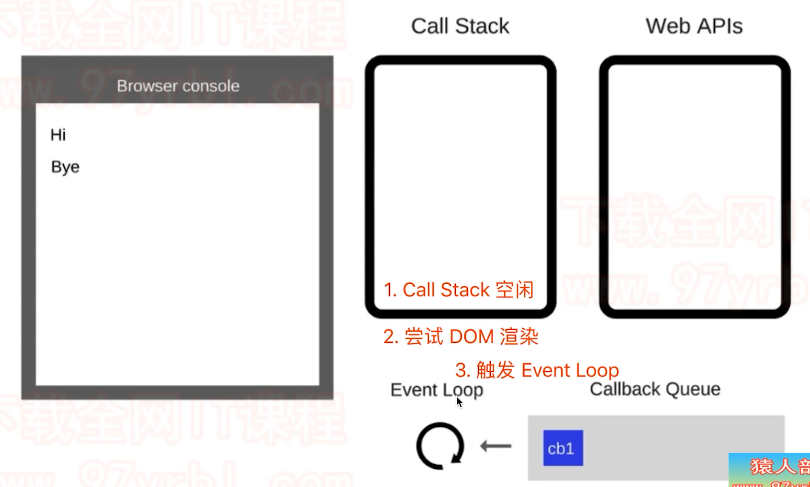

  

* 宏任务和微任务的区别

  * **宏任务：DOM 渲染后触发，如：setTimeout；**

  * **微任务：DOM 渲染前触发，如：Promise；**

    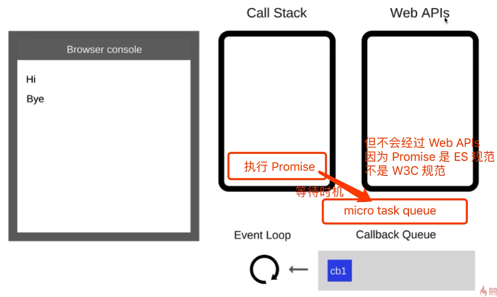

    

    * 微任务是 ES6 的语法规范，宏任务是浏览器的 API

```js
console.log('start')

setTimeout(() => {
    
    setTimeout(() => {
        console.log(0)
    })
    
    console.log(1)
    
    Promise.resolve().then(() => {
        console.log(2)
    })
    
    console.log(3)
})

// 初始化 Promise 时，传入的函数会立刻被执行
new Promise(resolve => {
    console.log(4)
    resolve()
}).then(() => {
    console.log(5)
})

console.log('end')

// ??
```


### 2.9 WebApi

#### 2.9.1 存储

> * 题目：cookie、localStorage 和 sessionStorage 的区别。

* cookie

  > * 本身用于浏览器和 server 通讯；
  > * 被“借用”来做本地存储；
  > * 可以通过 `document.cookie()` 来设置。

> cookie 的缺陷：
>
> * 存储大小，最大 4kb；
> * http 请求时需要发送到服务器，增加请求数据量；
> * 只能用 `document.cookie` 来修改，太过简陋。


* localStorage 和 sessionStorage

  > * HTML5 专门为存储而设计，最大可存 5M；
  > * API 简单易用 `setItem、getItem`；
  > * 不会随着 http 请求被发送出去。

> 区别：
>
> * localStorage 数据会永久存储，除非代码或手动删除；
> * sessionStorage 数据只存在于当前会话，浏览器关闭则清空；
> * 一般用 localStorage 会更多一些。


## 3. HTTP

题目：

* http 常见的状态码有哪些？

* http 常见的 header 有哪些？

* 什么是 Restful API?

* 描述一下 http 的缓存机制（重要）


### 3.1 状态码

#### 3.1.1 分类

| 状态码 | 分类             |
| ------ | ---------------- |
| 1xx    | 服务器接收到请求 |
| 2xx    | 请求成功         |
| 3xx    | 重定向           |
| 4xx    | 客户端错误       |
| 5xx    | 服务端错误       |


#### 3.1.2 常见状态码

| 状态码  | 解释                                                         |
| ------- | ------------------------------------------------------------ |
| 200     | 成功                                                         |
| 301     | 永久重定向（配合 location，浏览器自动处理）【应用：老域名永远不再用了】 |
| **302** | **临时重定向（配合 location，浏览器自动处理）【应用：本次去访问新的域名，下次还是去访问老的域名】** |
| **304** | **资源未被修改**                                             |
| 404     | 资源未找到                                                   |
| 403     | 没有权限                                                     |
| 500     | 服务器错误                                                   |
| 504     | 网关超时                                                     |


### 3.2 methods

#### 3.2.1 传统的 methods

| method | 作用             |
| ------ | ---------------- |
| get    | 获取服务器的数据 |
| post   | 向服务器提交数据 |


#### 3.2.2 现在的 methods

| method    | 作用     |
| --------- | -------- |
| get       | 获取数据 |
| post      | 新建数据 |
| patch/put | 更新数据 |
| delete    | 删除数据 |


### 3.3 Restful API

> * 一种新的 API 设计方法；

* 对比传统 API：
  * **传统 API 设计：把每个 url 当做一个功能；**
  * **Restful API 设计：把每个 url 当做一个唯一的资源（标识）；**

* 设计 Restful API：

  * 不使用 url 参数：
    * 传统 API 设计：/api/list?pageIndex=2
    * Restful API 设计：/api/list/2
  * 用 method 表示操作类型：
    * post 请求：/api/blog
    * patch 请求：/api/blog/100
    * get 请求：/api/blog/100

  

  

  

  

### 3.4 headers

#### 3.4.1 Request Headers

| Headers                | 解释                                |
| ---------------------- | ----------------------------------- |
| Accept                 | 浏览器可接收的数据格式              |
| Accept-Encoding        | 浏览器可接收的压缩算法，如 gzip     |
| Accept-Languange       | 浏览器可接收的语言，如 zh-CN        |
| Connection: keep-alive | 一次 TCP 连接重复使用               |
| Cookie                 | cookie                              |
| Host                   | 域名                                |
| User-Agent（简称 UA）  | 浏览器信息                          |
| Content-type           | 发送数据的格式，如 application/json |


#### 3.4.2 Response Headers

| Headers          | 解释                                              |
| ---------------- | ------------------------------------------------- |
| Content-type     | 返回数据的格式，如 application/json，Image/png 等 |
| Content-length   | 返回数据的大小，多少字节                          |
| Content-Encoding | 返回数据的压缩算法，如 gzip                       |
| Set-Cookie       | 修改 cookie                                       |


#### 3.4.3 自定义 header

#### 3.4.4 缓存相关的 headers

* Cache-Control
* Last-Modified      If-Modified-Since
* Etag      If-None-Match


### 3.5 http 缓存

> * 什么是缓存？
> * 为什么需要缓存？(减少网络请求)
> * 哪些资源可以被缓存？（js、css、img）


#### 3.5.1 强制缓存

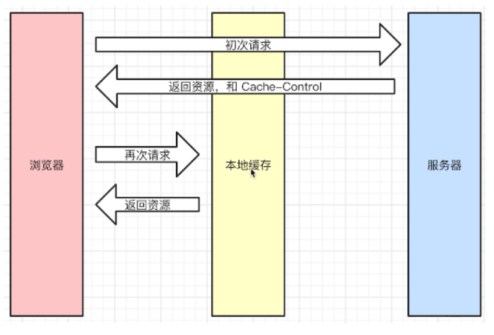


* Cache-Control：

  > * Response Headers 中
  > * 控制强制缓存的逻辑
  > * 例如 `Cache-Control: max-age=51840000`

  > Cache-Control 的值：
  >
  > * max-age
  > * no-cache
  > * private
  > * public
  > * no-store


* Expires

  > 已被 Cache-Control 代替


#### 3.5.2 协商缓存

> * 又叫，对比缓存

* 服务端缓存策略

  > * 服务端判断资源是否需要被缓存，服务器判断客户端资源，是否和服务端资源一样；
  > * 一致则返回 304，否则返回 200 和最新的资源；

  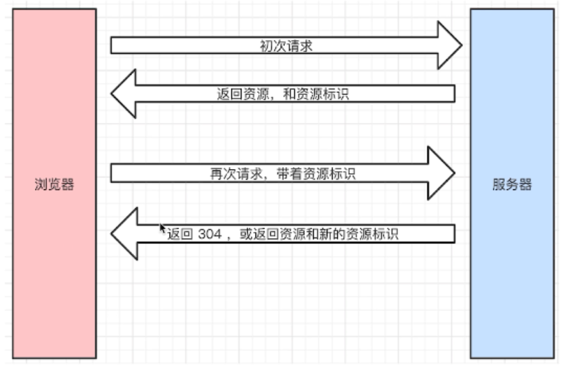

* 资源标识：

  > 在 Response Headers 中，有两种：
  >
  > * Last-Modified 资源的最后修改时间；
  > * Etag 资源的唯一标识（一个字符串，类似人类的指纹）

  

* Last-Modified：

  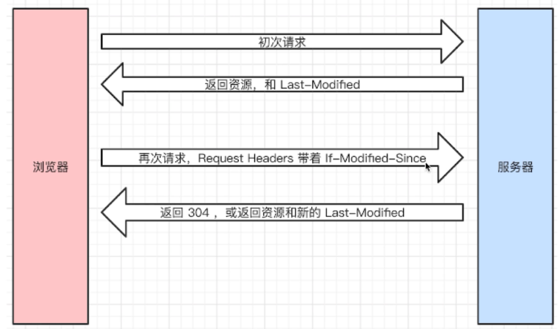


* Etag：(优先使用)

  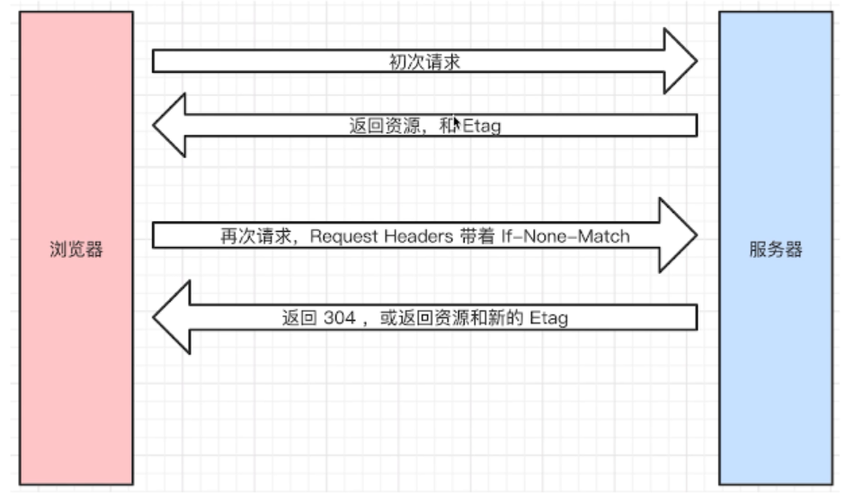


* 如果资源被重复生成，而内容不变，则 Etag 更精确。


#### 2.5.3 综述

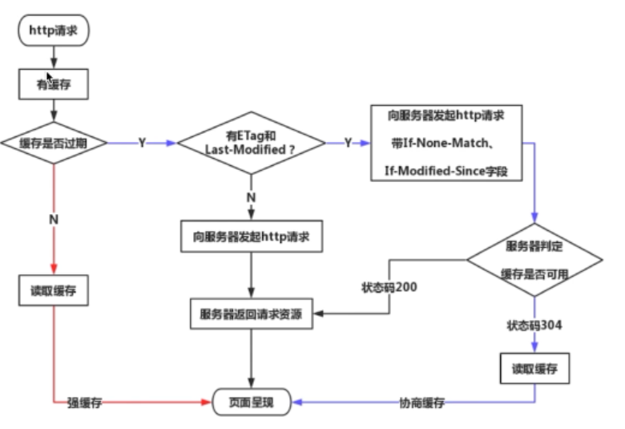


#### 2.5.4 刷新操作

* 正常操作：地址栏输入 url，跳转链接，前进后退等；
* 手动刷新：F5，点击刷新按钮，右击菜单刷新；
* 强制刷新：ctrl + F5。


* 正常操作：强制缓存有效，协商缓存有效；
* 手动刷新：强制缓存失效，协商缓存有效；
* 强制刷新：强制缓存失效，协商缓存失效。


## 4. 开发环境

### 4.1 git

* `git stash` 暂且修改
* `git stash pop`  恢复暂存的修改

### 4.2 调试工具

### 4.3 抓包

### 4.4 Webpack

### 4.5 Babel


## 5. 运行环境

> * 运行环境即浏览器（server 端有 node.js）；
> * 下载网页代码，渲染出页面，期间会执行若干 js 代码；


### 5.1 页面加载和渲染

* 题目：

  * 页面加载过程；

    > * DNS 解析：域名 -> IP 地址；
    > * 浏览器根据 IP 地址向服务器发起 http 请求；
    > * 服务器处理 http 请求，并返回给浏览器。

  * 页面渲染过程；

    > * 根据 HTML 代码生成 DOM Tree；
    > * 根据 CSS 代码生成 CSSOM；
    > * 将 DOM Tree 和 CSSOM 整合成 Render Tree；
    > * 浏览器根据 Render Tree 渲染页面；
    > * 遇到 <script> 则暂停渲染，优先加载并执行 JS 代码，完成再继续；
    > * 直至吧 Render Tree 渲染完成。

  * window.onload 和 DOMContentLoaded 的区别；

    > ```js
    > window.addEventListener('load', function() {
    >     // 页面的全部资源加载完才执行，包括图片、视频等
    > })
    > 
    > window.addEventListener('DOMContentLoaded', function() {
    >     // DOM 渲染完即可执行，此时图片、视频还没加载完
    > })
    > ```


### 5.2 性能优化

* 原则：

  * 多使用内存、缓存或其他方法；
  * 减少 CPU 计算量，减少网络加载耗时；
  * （适用于所有编程的性能优化 ---- 空间换时间）

  

* 让加载更快：

  * 减少资源体积：压缩代码；
  * 减少访问次数：合并代码，SSR 服务端渲染，缓存；
  * 使用更快的网络：CDN。

  

* 让渲染更快：

  * CSS 放在 head， JS 放在 body 最下面；
  * 尽早开始执行 JS，用 DOMContentLoaded 触发；
  * 懒加载（图片懒加载，上滑加载更多等）。

  

* 让渲染更快：

  * 对 DOM 查询进行缓存；
  * 频繁 DOM 操作，合并到一起插入 DOM 结构；
  * 节流 throttle 防抖 debounce

* 缓存：
  * 静态资源加 hash 后缀，根据文件内容计算 hash；
  * 文件内容不变，则 hash 不变，则 url 不变；
  * url 和文件不变，则会自动触发 http 缓存机制，返回 304。


#### 5.2.1 防抖

#### 5.2.2 节流


### 2.7 JS Web API

> * JS 基础知识，规定语法（ECMA 262 标准）
> * JS Web API，网页操作的 API（W3C 标准）
> * 前者是后者的基础，两者结合才能真正实际应用


#### 2.7.1 DOM

> Document Object Model

* 题目：
  * DOM 是哪种数据结构
  * DOM 操作的常用 API
  * attr 和 property 的区别

  * 一次性插入多个 DOM 节点，考虑性能


* DOM 节点操作

> * 获取 DOM 节点
> * attribute
> * property

* 获取 DOM 节点

```js
document.getElementById()
document.querySelectorAll()
```


* propertty 形式

  ```js
  // propertty 形式修改的是 js 变量的属性
  p1.style.width = '100px'
  p1.className = 'red'
  ```

* attribute

  ```js
  // 通过 attribute 可以修改 html 标签的属性
  p1.setAttribute('data-name', 'imooc')
  console.log(p1.getAttribute('data-name'))
  
  p1.setAttribute('style', 'font-size: 50px')
  console.log(p1.getAttribute('style'))
  ```

* 总结：

  * property：修改对象属性，不会体现到 html 结构中；
  * attribute：修改 html 属性，会改变 html 结构；
  * 两者都有可能引起 DOM 重新渲染。


* DOM 结构操作

* 新增/插入节点；

* 获取子元素列表，获取父元素；

* 删除子元素；


* DOM 性能
  * DOM 操作非常“昂贵”，避免频繁的 DOM  操作；
  * 对 DOM 查询做缓存；
  * 将频繁操作改为一次性操作；

```js
// 不缓存 DOM 查询结果
for (let i = 0; i < document.getElementByTagName('p').length; i++) {
    // 每次循环，都会计算 length，频繁进行 DOM 查询
}

// 缓存 DOM 查询结果
const pList = document.getElementByTagName('p')
const length = pList.length
for (let i = 0; i < length; i++) {
    // 缓存 length，只进行一次 DOM 查询
}
```

```js
const listNode = document.getElementById('list')

// 创建一个文档片段，此时还没有插入到 DOM 树中
const frag = document.createDocumentFragment()

// 执行插入
for (let x = 0; x < 10; x++) {
    const li = document.createElement('li')
    li.innerHTML = 'List item' + x
    frag.appendChild(li)
}

// 都完成之后，再插入到 DOM 树中
listNode.appendChild(frag)
```


#### 2.7.2 BOM

> Browser Object Model

* 题目：

  * 如何识别浏览器的类型；
  * 分析拆解 url 各个部分；

* location 和 history

  ```js
  location.href
  location.protocol
  location.pathname
  location.search
  location.hash
  
  history.back()
  history.forward()
  ```


#### 2.7.3 事件

> * 编写一个通用的事件监听函数
> * 描述事件冒泡的流程
> * 无限下拉的图片列表，如何监听每个图片的点击？


#### 2.7.4 Ajax

> * 手写一个简易的 Ajax
> * 跨域的常用实现方式

* XMLHttpRequest

  ```js
  // get 请求
  const xhr = new XMLHttpRequest()
  
  xhr.open("GET", "/api", true)
  
  xhr.onreadystatechange = function() {
      if (xhr.readyState === 4) {
          if (xhr.status === 200) {
              alert(xhr.responseText)
          }
      }
  }
  
  xhr.send()
  
  // post 请求
  const xhr = new XMLHttpRequest()
  
  xhr.open("POST", "/api", true)
  
  xhr.onreadystatechange = function() {
      if (xhr.readyState === 4) {
          if (xhr.status === 200) {
              alert(xhr.responseText)
          }
      }
  }
  
  const postData = {
      userName: 'zhangsan',
      password: 'xxx'
  }
  
  xhr.send(JSON.stringify(postData))
  ```

  

* 同源策略
  * ajax 请求时，浏览器要求当前网页和 server 必须同源（安全）；
  * 同源：协议、域名、端口，三者必须一致；
  * 加载图片、css 和 js 可无视同源策略；


* 跨域
  * 所有的跨域，都必须经过 server 端允许和配合；
  * 未经 server 端允许就实现跨域，说明浏览器有漏洞；


