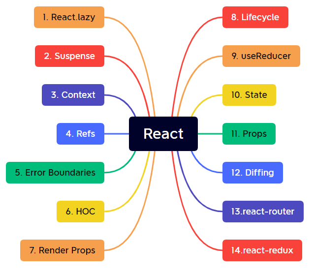

# 面试题汇总

* [前端进阶指南 ProcessOn](https://www.processon.com/view/link/61c53fb31efad45a2b42afd9#map)
* [大厂面试题每日一题](https://q.shanyue.tech/fe/)
* [56个 JavaScript 高级手写知识点](https://juejin.cn/post/7023906112843808804#comment)


> * 动画
> * 协议
> * 安全
> * 网络
> * 性能优化

# 手写题

* [x] 防抖和节流
* [x] 数组去重（三种方式）
* [x] call()、apply() 和 bind()
* [x] Promise
* [x] new
* [x] instanceof


# 面向对象

> * 构造函数
> * 原型（`prototype`）
> * 原型对象
> * 实例
> * 隐式原型（`[[Prototype]]` / `__proto__`）
> * 原型链
> * `instanceof`
> * `new`
> * 继承
> * `Object.create()`


## 1. 名词

**实例/对象（引用类型的实例和自定义类型的实例）身上默认可以使用的属性和方法**

> `var instance = new Object()`
>
> `instance.`

1. `__proto__`

2. `constructor`（原型对象属性）

3. `hasOwnProperty`（原型对象方法，继承自 Object）

4. `isPrototypeOf`（原型对象方法，继承自 Object）

5. `propertyIsEnumable`（原型对象方法，继承自 Object）

6. `toLocaleString`（原型对象方法，继承自 Object）

7. `toString`（原型对象方法，继承自 Object）

8. `valueOf`（原型对象方法，继承自 Object）


## 2. 知识点

1. 面向对象（OO）语言的共同点，都有类的概念。通过类可以创建任意多个具有相同属性和方法的对象。
2. ECMAScript 中没有类的概念，因此它的**对象**也与基于类的语言中的对象有所不同。
3. ECMAScript 把对象定义为：“无序**属性**的集合，其属性可以包含基本值、对象或函数”。
4. 每个对象都是基于一个引用类型创建的，也可以是自定义类型。
5. 引用类型的值（**对象**）是引用类型的一个**实例**。
6. 引用类型是一种数据结构，可以类比为类。
7. 对象属性在创建时都带有一些**特征值**，JavaScript 通过这些特征值来定义它们的行为。
8. 属性类型：有两种类型，数据属性和访问器属性。每种属性都有一些用来描述其行为的特性。这些特性是 JavaScript 内部使用的，不可以在 JavaScript 中直接访问它们。
9. 数据属性：[[Configurable]]、[[Enumerable]]、[[Writable]] 和 [[Value]]。直接在对象上定义的属性，这四个特性都被设置为 true。
10. `Object.defineProperty()`
11. 访问器属性：[[Configurable]]、[[Enumerable]]、[[Get]] 和 [[Set]]。不能直接定义访问器属性，必须使用 `Object.defineProperty()` 来定义。
12. 读取属性的特性：`Object.getOwnPropertyDescriptor()`
13. 【*1】创建对象 -- 工厂模式。思路：1. 创建一个对象；2. 往这个对象身上添加属性；3. 返回这个对象。缺点：无法识别对象的类型。
14. 【*2】创建对象 -- 构造函数模式。思路：1. 定义一个构造函数（函数名以大写开头的函数）；2. 使用 new 操作符创建构造函数的实例。使用 new 操作符调用构造函数：1. 创建一个对象；2. 将构造函数的作用域赋给新对象（将 this 指向这个新对象）；3. 执行构造函数中的代码（为新对象添加属性）；4. 返回这个新对象（如果构造函数没有返回对象类型，则返回这个新对象，否则返回构造函数的返回值）。优点：创建自定义的构造函数意味着将来可以将它的实例标识为一种特定的类型（比如 Person 类型）。缺点：为了让实例共享（功能相同的）方法，需要将方法的定义放到构造函数外部（全局作用域中），从而破坏了程序的封装性质。
15. `instanceOf` 操作符，思考：为什么使用对象字面量重写了构造函数的原型（ `构造函数.prototype`）后，`instanceof` 操作符依然有效。 `instanceof` 的原理是什么。
16. 实例身上的 constructor 属性指向该实例的构造函数。
17. 【*3】创建对象 -- 原型模式。思路：利用函数的 `prototype` 属性，将实例共享的属性和方法定义到原型对象身上。优点：实例可以共享属性和方法。缺点：由于定义在原型上的属性和方法被所有实例所共享，所以有一个实例修改了某个属性将会影响到其他实例。不可以向构造函数传递参数。
18. 【1】每个函数都有一个 `prototype`（原型）属性。这个属性是一个指针，指向一个对象（原型对象），这个对象的用途是**包含可以由特定类型的所有实例共享的属性和方法**（包括 `constructor` 属性）。所以 `prototype` 所指向的对象，就是通过调用构造函数而创建的实例对象的**原型对象**。【2】所有原型对象都会自动获得一个 `constructor` 属性，这个属性包含一个指向 prototype 属性所在函数的指针。原型对象中的其他方法，则是从 Object 继承而来的。【3】当调用构造函数创建一个新实例后，该实例的内部将包含一个指针（`__proto__`），指向构造函数的原型对象。
19. `构造函数.prototype.isPrototypeOf(实例)`，如果 `[[Prototype]] ` 指向调用 `isPrototypeOf()` 方法的对象，那么这个方法就返回 `true`（例如：`Person.prototype.isPrototypeOf(person)`）。
20. `Object.getPrototypeOf(实例)`，该方法返回 `[[Prototype]]` 的值，利用该方法，可以方便的取得一个对象的原型对象。
21. `实例.hasOwnProperty(属性)` ，该方法可以判断属性是在实例自身还是存在于原型对象身上。
22. `in`，有两种方式使用 `in` 操作符：单独使用和在 `for-in` 循环中使用。一个属性，不管是在实例身上还是在原型对象身上，只要实例可以访问该属性，则 `in` 操作符的结果为 `true`。
23. 【1】`for-in` 循环，返回的是所有能够通过对象访问的、**可枚举**的属性。**既包括实例属性，也包括原型中的属性**。【2】`Object.keys(实例)` / `Object.keys(构造函数.prototype)` 方法，该方法可以取得对象身上所有的**可枚举的实例属性**，返回一个包含所有可枚举属性的字符串数组。【3】`Object.getOwnPropertyNames(实例)` / `Object.getOwnPropertyNames(构造函数.prototype)` 方法，该方法可以取得**所有实例属性**，无论它是否可枚举。
24. 使用一个包含所有属性和方法的对象字面量来重写整个原型对象。这种方法会出现一个问题，原型对象中的 `constructor` 属性将不再指向原来的构造函数，而是指向 Object 构造函数。可以在原型对象中显示的将 `constructor` 属性的值设置为原来的构造函数，但是这样又会出现新的问题，即 `constructor` 属性变成可枚举属性（可以通过 `for-in` 循环获取）。可以通过 `Object.defineProperty()` 方法来定义 `constructor` 属性。
25. 【*4】创建对象 -- 组合使用构造函数模式和原型模式。思路：将实例的私有属性定义在构造函数中，将需要共享的属性和方法定义在原型对象中。
26. 【*5】创建对象 -- 动态原型模式。在构造函数中检查某个应该存在的方法是否有效，来决定是否需要初始化原型。
27. 【*6】创建对象 -- 寄生构造函数模式。思路：构造函数的形式与工厂模式一模一样（手动创建一个对象，往该对象身上添加属性和方法，最后返回该对象），与工厂模式不同的是该构造函数将会使用 `new` 操作符来调用。应用：在不向原生对象的原型上添加方法的前提下，创建出具有特殊方法的实例（例如，不向 `Array.prototype` 上添加方法，但是创建出来的数组却具有特殊的方法）。
28. 【*7】创建对象 -- 稳妥构造函数模式。思路：没有公共属性，其方法不引用 `this`，不使用 `new` 调用构造函数。必须通过实例的方法才能访问到属性。
29. 【*1】继承 -- 原型链。优点：可以轻松实现继承。缺点：【1】由于使用原型链实现继承的原理是将一个原型对象作为另一个类型的实例，所以原型对象会包含另一个类型的所有属性，又因为实例指向相同的原型对象，所以实例将共享原型身上的属性和方法（如果是引用类型的属性，则会容易出错）。【2】在创建子类型的实例时，无法向超类型的构造函数传递参数。
30. 构造函数、原型和实例的关系（原型链的基本概述）：每一个构造函数都有一个 prototype 属性指向它的原型对象，原型对象内部有一个 constructor 属性指向该原型对象的构造函数，通过 new 操作符调用构造函数可以创建实例，实例内部有一个 [[Prototype]] 指针，指向原型对象。假如让原型对象等于另一个类型的实例，那么此时的原型对象将包含一个指向另一个原型对象的内部指针，另一个原型对象也会包含一个指向另一个构造函数的指针。假如另一个原型对象又是另一个类型的实例，那么上述关系依然成立，如此关系层层递进，就构成了实例与原型的链条。这就是所谓的原型链的基本概念。
31. 【*2】继承 -- 借用构造函数（伪造对象 / 经典继承）。思路：在子类型中使用 `call` 或 `apply` “借调”超类型的构造函数。优点：实例对象可以有独立的属性和方法。可以向超类型传递参数。缺点：必须将所有方法都定义在构造函数中，失去了函数的复用性。超类型原型中的属性和方法不能被子类型使用。
32. 【*3】继承 -- 组合继承（伪经典继承）。思路：将原型链和借用构造函数的技术组合在一起。使用原型链实现对原型属性和方法的继承，而通过借用构造函数来实现对实例属性的继承。这样，即通过在原型上定义方法实现了函数的复用，又能保证每个实例都有它自己的属性。优点：【1】每个实例可以有自己属性，也可以使用相同的方法。【2】在子类型中可以向超类型传递参数。
33. 【*4】继承 -- 原型式继承。思路：定义一个工厂函数，在这个函数内部先创建一个临时性的构造函数，然后将传入的对象作为这个构造函数的原型对象，最后返回这个临时类型的一个新实例。从本质上讲，这个工厂函数式对传入的对象做了一次浅复制。
34. `Object.create()` 方法，规范化了原型式继承。该方法接收两个参数，并返回一个对象。第一个参数是作为返回对象的 `[[Prototype]]` 属性所指向的原型对象，第二个参数（可选）是一个为新对象定义额外属性的对象（与 `Object.defineProperties()` 方法的第二个参数格式相同）。在传入一个参数的情况下，`Object.create()` 的行为与上述的构造函数行为相同。
35. 【*5】继承 -- 寄生式继承。思路：在原型式继承的基础上，为新创建的对象扩展对象的属性和方法。应用：在主要考虑对象而不是自定义类型和构造函数的情况下，寄生式继承也是一种有用的模式。
36. 【*6】继承 -- 寄生组合式继承。组合式继承存在的问题：在子类型的实例和实例的原型对象上都会存在超类型构造函数内的属性。思路：利用寄生式继承仅仅让子类型的原型内部的 `[[Prototype]]` 属性指向超类型的原型对象，而不是像组合式继承那样通过 `new` 操作符调用超类型构造函数，从而避免了子类型的原型上也存在超类型构造函数中的属性。
37. `Object.setPrototypeOf(实例, 原型对象)`，该方法允许修改任意指定实例的原型。
38. `super` 是指向当前对象原型的一个指针，实际上就是 `Object.getPrototypeOf(实例)` 的值。可以在简写的方法之内使用 `super` 引用来调用对象原型上的任何方法。在多级继承中，`super` 引用依然有效。
39. 在 ES6 之前，“方法”的概念可以理解为对象的函数属性。ES6 则正式做出了定义：方法是一个拥有 `[[HomeObject]]` 内部属性的函数，此内部属性指向该方法所属的对象。任何对 `super` 的引用都会使用 `[[HomeObject]]` 属性来判断要做什么。具体步骤：【1】在 `[[HomeObject]]` 上调用 `Object.getPrototypeOf()` 来获取对原型的引用；【2】在该原型上查找同名函数；【3】创建 `this` 绑定并调用该方法。
40. 【*1】类 -- 形式。ES6 中引入了“类”的概念，但是其内部实现任然是基于原型。从形式上来看，ES6 中的类是使用 `class` 关键字声明，内部类似对象字面量的方法简写，并且方法之间不需要逗号。类中使用特殊的 `constructor()` 方法直接定义一个构造器，最好是将实例身上可能出现的自有属性全都放到 `constructor()` 构造器函数内定义。可以在类的内部随意添加方法，这些方法都会被放到实例的原型（`类名.prototype`）身上，并且这些方法都是不可枚举的。
41. 【*2】类 -- 对比 ES5 中的自定义类型声明（基于构造函数与原型链的类型声明）。相同点：【1】类声明是一个以自定义类型声明方式为基础的语法糖。【2】使用 `typeof` 运算法操作类名，会得到 "`function`" 结果，并且在类中定义的方法也同样会被添加到原型上。【3】值得注意的是，可以将自定义类型与类混合使用。差异：【1】类中所有的方法都是不可枚举的；【2】类中所有的方法都是不可以使用 `new` 操作符来调用的，因为这些方法内部都没有 `[[Construct]]` 属性；【3】调用构造器（可以理解为类名，因为在内部实现时会将 `constructor` 的名称设置的与类名同名）时，必须使用 `new` 操作符；【4】类声明不会被提升（行为与 `let` 相似）；【5】类声明中的所欲代码都自动运行在严格模式下；【6】不可以在类的内部重写类名。
42. 【*3】类 -- 类表达式、具名类表达式和作为一级公民的类。
43. 【*4】类 -- 访问器属性（注意，是属性不是方法）。直接在方法前面使用 `get` 和 `set` 关键字即可定义访问器属性，这和对象字面量中的写法非常类似。如果在 ES5 中则需要使用 `Object.defineProperty()` 方法来实现。
44. 【*5】类 -- 需计算的成员名。这和对象字面量中的形式一模一样。
45. 【*6】类 -- 生成器方法。可以在类中定义生成器方法，这样就可以生成一个自带迭代器的自定义类型。可以直接使用 `for-of` 循环迭代该实例（自定义类型本身变成了可迭代对象）。
46. 【*7】类 -- 静态成员。静态成员，即只能通过类（构造函数）访问的成员，无法通过实例访问。在 ES5 中如果想定义静态成员，可以直接将成员添加到构造函数上。在 ES6 中可以通过在任何方法或访问器属性前面使用 `static` 关键字定义静态成员。
47. 【*8】类 -- 继承。【1】使用 `extends` 关键字可以轻松的实现类的基础，基础了其他类的类被称为派生类。【2】在派生类中如果定义了构造器（`constructor()` 方法），则必须在构造器中使用 `super()` 方法调用父类的构造器。如果没有指定构造器，`super()` 方法将会被自动调用，并且会使用调用构造器创建新实例时提供的所有参数作为 `super()` 方法的参数（`super(...args)`）。这样可能会导致 `super()` 方法提供的参数与父类构造器需要接收的参数数量不符合的问题。【3】关于 `super()` 方法的几点说明：1. 只能在派生类中使用 `super()`。2. 在构造器中，必须在使用 `this` 之前调用 `super()` 方法，因为 `super()` 方法负责初始化 `this`。3. 在构造器中返回一个对象，就可以避免使用 `super()` 方法。【4】在派生类中定义同名方法即可屏蔽父类中的方法。【5】类中的静态成员也是可以被派生类所继承的。
48. 【*9】类 -- 继承（从表达式中派生类）。`extends` 关键字后面不光可以写父类的类名，也可以写一个表达式（比如函数调用，在该函数内部返回父类的类名等更复杂的功能）。
49. 【*10】类 -- 继承（继承内置对象）。ES6 中的类可以继承自内置对象（Array、ArrayBuffer、Map、Promise、RegExp、Set 和 类型化数组）。
50. 【*11】类 -- `new.target` 。【1】在方法内使用 `new.target` 可以用来判断该方法是否是使用 `new` 操作符调用的。在构造器内使用 `new.target` 可以判断该类是否是使用 `new` 操作符调用的。【2】如果在父类的构造器中使用 `new.target` ，但是实例是通过 `new` 操作符调用派生类创建的，那么父类构造器中的 `new.target` 将返回派生类的类名。【3】使用 `new.target` 的特性，可以用来创建一个静态的不可被实例化的基类。


## 3. 面试题

1. 如何理解**原型**？如何理解原型链？(掘金小册)
2. 如何自己实现一个 **instanceof** 运算符？（掘金小册）
5. 使用 **new** 操作符时会进行哪些操作？（[MDN](https://developer.mozilla.org/zh-CN/docs/Web/JavaScript/Reference/Operators/new)）
6. 如何自己实现一个 **new** 操作符？（[掘金](https://juejin.cn/post/6844903976081555470)）
7. JavaScript 中实现**继承**有哪些方式？（[掘金](https://juejin.cn/post/6844903976081555470)）
8. **ES5/ES6 继承**除了形式上还有哪些区别？
9. ES6 中的 **class** 原理是什么？


## 4. 练习题

1. [继承](https://juejin.cn/post/6844904098941108232)


# 函数

> * this
> * arguments
> * 作用域
> * 执行上下文
> * `call()`、`apply()`、`bind()`
> * 闭包


## 1. 知识点

1. 参数。在调用函数时，可以忽略命名参数的个数，ES 对传递的参数个数没有严格的限制。因为参数在函数内部是用一个数组来表示的，函数内部使用 `arguments` 对象来访问这个参数数组，从而获取到传递给函数的每一个参数。
2. `arguments` 是一个类（类似）数组对象，【1】可以使用方括号语法来访问 `arguments` 对象的每一个元素；【2】可以使用 `length` 属性来获取 `arguments` 对象的长度；【3】但是该对象身上并没有类似 `push()` 和 `splice()` 这样的方法。【4】没有传递值的参数将自动被设置为 `undefined`。【5】非严格模式下可以使用 `arguments` 重写命名参数的值，但是严格模式下不允许这么做。
3. ES 中的函数没有重载功能（因为函数名实际上只是一个指针，如果重复赋值，则后面的值会覆盖前面的值），但是可以通过在函数内部判断 `arguments.length` 的值来执行不同的操作，从而模拟类似重载的功能。
4. ES 中所有函数的参数都是按值传递的。如果传递给参数的是基本类型的值则会类似深拷贝，如果是引用类型的值则会类似浅拷贝。
5. 使用 `typeof` 操作符检测函数的类型时，会返回 `"function"`。
6. 【*1】执行环境与作用域。【1】执行环境，也叫作环境，定义了变量或函数有权访问的其他数据，决定了它们各自的行为；【2】变量对象，每个执行环境都有一个与之关联的变量对象，环境中定义的所有变量和函数都保存在这个对象中（无法直接访问变量对象）；【3】环境栈，每个函数都有自己的执行环境，当函数被执行时会被推入一个环境栈中，当函数执行完毕后会被从执行栈中弹出；【4】作用域链，当代码在一个环境中执行时，会创建变量对象的一个作用域链。其用途是保证对执行环境有权访问的变量和函数的有序访问；【5】活动对象，如果执行环境是函数，则将其活动对象作为变量对象。活动对象最开始只包含 `arguments` 对象这一个变量；【6】访问规则，作用域链只能向上搜索，无法向下搜索。
7. 函数的本质。【1】ES 中函数的本质是对象；【2】每个函数都是 Function 类型的实例，所以函数也是一种引用类型；【3】函数名只是一个指向函数对象的指针。
8. 函数声明与函数表达式的区别。【1】函数声明会被提升；【2】函数表达式只有当代码执行到函数声明的位置时才会被赋值。
9. 可以将函数当做值传递给另一个参数，也可以将函数作为另一个参数的返回值。
10. 函数的**内部**属性：`arguments、this 和 caller`。【1】`arguments` 对象指向函数的参数数组。【2】`this` 是函数内部的一个特殊对象，`this` 引用的是函数执行时的环境对象。【3】函数内部的 `caller` 属性保存着调用该函数的函数的引用，如果在全局环境中调用函数，则 `caller` 的值为 `null`。
11. 深入 `this`。【1】在（浏览器的）全局环境中直接执行函数，在非严格模式下 `this` 值为 `windows`（Node.js 全局环境中值为 `global`），在严格模式下 `this` 值为 `undefined`（Node.js 中也一样）。【2】当一个对象使用点的方式去调用函数，则 `this` 的值指向该对象。【3】当使用 `call()、apply() 或 bind()` 调用函数时，则 `this` 的值为传入这些方法的第一个参数。在非严格模式下，当这些方法的第一个参数为 `this、null 或 undefined` 时，函数内部的 `this` 属性将等于 `windows` 对象。
12. 函数的属性和方法。【1】`length` 属性。该属性返回该函数的命名参数的个数。【2】`prototype` 属性。该属性不可枚举，该属性指向函数的原型对象。【3】函数的自有方法：`call()、apply() 和 bind()`。`apply()` 方法，接收两个参数，第一个参数是在其中运行函数的作用域，第二个参数是一个参数数组（可以是 `Array` 的实例，也可以是 `arguments` 对象）。`call()` 方法，接收多个参数，第一个参数是在其中运行函数的作用域，剩下的参数将作为将要运行的函数的参数传入。`bind()`方法，会创建一个函数的实例（返回一个函数），其 `this` 值将会被绑定到传给 `bind()` 函数的值。`bind()` 方法的参数形式与 `call()` 方法相同。【4】函数继承而来的方法：`toLocaleString()、toString()、valueOf() 等`。
13. 【*1】递归。一个函数通过名字调用自身。
14. 【*2】闭包。【1】概念：闭包是指有权访问另一个函数作用域中的变量的函数（内部函数）。在一个函数的内部创建（返回）一个函数（通常是匿名函数），即可创建（形成）闭包。【2】现象：这个在函数内部创建（返回）的函数，虽然被返回了，而且在其他地方被调用，但它仍然可以访问其在创建时的外层函数中的变量。【3】理解闭包的关键是理解作用域链以及作用域链有什么作用的细节。【4】闭包只能取包含函数中任意变量的最后一个值。
15. 【*3】闭包中的 `this` 值。函数在被调用时会自动取得两个**特殊变量**：`this 和 arguments`。这两个变量的特殊性体现在，内部函数在搜索这两个变量时，只会搜索到其活动对象为止。因此永远不可能直接访问外部函数中的这两个变量（如果将外部函数中的 `this` 保存在内部函数能够访问到的一个变量里，就可以让闭包访问到该对象了）。
16. 【*4】可以使用立即调用函数实现块级作用域。
17. 【*5】函数表达式中的其他概念：私有变量、静态私有变量、模块模式（增强版的单例对象（JavaScript 以对象字面量的方式创建单例对象））和增强的模块模式。
18. 【*1】函数的参数默认值，ES6 允许给函数的参数设置默认值，以便参数未被正式传递进来时使用。
19. 【*2】关于 `arguments` 对象与函数的命名参数的一些说明。【1】在 ES5 非严格模式下，`arguments` 对象会及时反映出函数具名参数的变化（`arguments` 对象始终与命名参数保持同步）。【2】在 ES5 严格模式下，`arguments` 对象无法实时反映出函数具名参数的变化。【3】在 ES6 中，`arguments` 对象也无法实时反映出函数具名参数的变化。并且 `arguments` 对象只能反映出函数具名参数的初始调用状态（假如函数的具名参数中存在默认参数，那么这些参数将不会存在于 `arguments` 对象中）。
20. 【*3】参数默认值表达式。参数默认值不光可以是普通值，也可以是表达式。【1】当参数默认值是函数时，如果是函数名，则表示是对该函数的引用。如果是函数调用，则并不会立即调用，而是等到函数被调用并且该位置的参数没有传递的情况下才会去调用参数默认值函数。【2】函数的参数默认值，后面的参数可以等于前面的参数，但是反过来不行。
21. 【*4】剩余参数。在 ES5 中如果想要使用匿名参数，那么只能通过操作 `arguments` 对象来实现，但是这些操作一般都比较麻烦。ES6 中引入了剩余参数的概念，由 `...` 和一个具名参数指定。它是包含传递给函数的剩余参数组成的一个数组（将多个独立的参数合并成一个数组）。【1】剩余参数的数量并不会通过函数的 `length` 属性表现出来。【2】剩余参数只能有一个，并且要放在所有具名参数的最后面。【3】不可以在对象的 `setter` 属性中使用剩余参数，因为对象的 `setter` 属性要求必须只能接收一个参数。
22. 【*5】扩展运算符（`...`）。将一个数组分割成独立的项传递给函数的参数。在使用扩展运算符时，也可以混入其他的值一并传递给函数的参数。
23. 【*6】函数的名称属性 `name`。方便在调试时获取有用的信息。
24. 【*7】`new.target` 元属性（非对象身上的属性）。在函数的内部有两个方法 `[[Call]] 和 [[Construct]]` 。当使用 `new` 操作符调用函数时，`[[Construct]]` 方法将会被调用，负责创建一个新的对象，并且 `new.target` 会被填入 `new` 操作符的作用目标。当正常调用函数时，`[[Call]]` 方法将会被执行，运行的代码是显示的函数体，`new.target` 的值为 `undefined`。
25. 【*8】箭头函数。【1】没有 `this、arguments、super 以及 new.target 绑定`。这些值都由包括箭头函数最近的非箭头函数决定。【2】不能使用 `new` 操作符调用箭头函数。【3】箭头函数没有原型对象。【4】可以使用 `call()、apply() 与 bind()` 方法调用箭头函数，但是无法改变箭头函数的 `this` 值。
26. 【*9】在写递归函数时可以考虑“尾调用优化”。

 

## 2. 面试题

1. 如何正确判断 **this**？箭头函数的 this 是什么？(掘金小册)
2. **call()、apply() 和 bind()** 的作用分别是什么？各自有什么区别？如何自己实现它们？（[掘金](https://juejin.cn/post/6844903976081555470)）


## 3. 练习题

1. [this](https://juejin.cn/post/6844904083707396109)


# 异步

> * setTimeout
> * setInterval
> * 事件回调
> * 回调函数
> * Promise
> * 迭代器
> * 生成器
> * async/await
> * Event Loop
> * 宏任务队列
> * 微任务队列


## 1. Promises/A+ 规范

> 一个全面开放的标准，可互操作的 JavaScript promises。

* **术语**

  > `promise、thenable、value、exception、reason`

  1. `promise`：是一个拥有 `then` 方法的对象或函数，其行为符合本规范。
  2. `thenable`：是一个定义了 `then` 方法的对象或函数，这个主要是用来兼容老的 `Promise` 实现。
  3. `value`：指 `resolve` 出来的值，可以是任何合法的 JS 值（包括 `undefined、thenable 和 promise` 等）。
  4. `exception`：异常，在 `Promise` 里面使用 `throw` 抛出来的值。
  5. `reason`：拒绝原因，是 `reject` 里面传的参数，表示 `reject` 的原因。

* **Promise 状态**

  1. `pending`：一个 `promise` 在 `resolve` 或 `reject` 前就处于这个状态。
  2. `fulfilled`：一个 `promise` 被 `resolve` 后，就处于这个状态。该状态不可再改变，而且必须拥有一个不可变的值（`value`）。
  3. `rejected`：一个 `promise` 被 `reject` 后，就处于这个状态。该状态不可再改变，而且必须拥有一个不可变的原因（`reason`）。

* **then 方法**

  * 一个 `promise` 必须拥有一个 `then` 方法来访问它的值（`value`） 或拒绝原因（`reason`）。`then` 方法有两个参数（`onFulfilled 和 onRejected`）。

  * 参数可选。`onFulfilled 和 onRejected` 都是可选参数。如果 `onFulfilled`（或 `onRejected`）不是函数，其必须被忽略。

  * `onFulfilled`（`onRejected`）特性。如果 `onFulfilled`（`onRejected`）是函数，当 `promise` 执行结束后（被拒绝执行后）其必须被调用，其第一个参数为 `promise` 的终值 `value`（拒因 `reason`）。在 `promise` 执行结束（被拒绝执行）前其不可被调用。其调用次数不可超过一次。

  * 多次调用。`then` 方法可以被同一个 `promise` 调用多次。当 `promise` 成功执行时，所有 `onFulfilled` 需按照其注册顺序依次回调。当 `promise` 被拒绝执行时，所有的 `onRejected` 需按照其注册顺序依次回调。

  * `then` 方法的返回值。**`then` 方法必须返回一个 `promise` 对象**。

    > `promise2 = promise1.then(onFulfilled, onRejected)`

    * 如果 `onFulfilled 或 onRejected` 返回一个值 `x`，则运行**`Promise` 解决过程**：`[[Resolve]](promise2, x)`
    * 如果 `onFulfilled 或 onRejected` 抛出一个异常 `e`，则 `promise2` 必须拒绝执行，并返回拒因 `e`。
    * 如果 `onFulfilled` 不是函数，并且 `promise1` 成功执行，`promise2` 必须成功执行并返回相同的值。
    * 如果 `onRejected` 不是函数，并且 `promise1` 拒绝执行，`promise2` 必须拒绝执行并返回相同的拒因。


# React

## 1. 框架特性

**1.1 声明式 & 数据驱动渲染**

* 不论是 `JSX`，还是 `Vue` 中的模板，本质上都是描述了**状态**与**视图**之间的映射关系。这也就是所谓的声明式渲染。

  > UI = render(state)

* 声明式渲染（框架）的关键是如何知道 Web 应用的状态在运行时是否发生了变化，从而根据上面的公式重新输出一个新的 UI。


**1.2 组件**

* 组件作为应用的基本抽象单元，可以将组件分为四种类型：
  1. 展示型组件：
     * 展示型组件是最直接也是最常用的组件，就是用数据渲染视图，“数据进，DOM 出”。
  2. 接入型组件
     * 接入型组件通常会跟接入**数据**的 `server` 层打交道。包含一些和服务器或数据源打交道的逻辑，然后接入型组件会将数据往下传，传给比较简单的展示型组件。在 React 中这类组件被称为**容器组件**。
  3. 交互型组件
     * 交互性组件最简单的例子是对表单组件的封装和增强。大部分组件库，例如 Antd 都是以交互型组件为主。这类组件会有比较复杂的交互逻辑，但是它是一个非常通用的逻辑，所以它**强调复用**。
  4. 功能型组件
     * 功能型组件是比较抽象的组件。用 Vue 举例，路由的 `<router-view>` 和 Vue 自带的 `<transition>` 都属于功能型组件。它本身不渲染任何内容，它是一个逻辑型的组件。它通常作为一个扩展或一种抽象机制存在。


**1.3 其他特性**

* 路由
* 状态和数据流管理（Vuex 与 Redux）
* CLI 工具
* 同构/服务端渲染
* CSS 管理方案
* ...


## 2. 框架内容

**2.1 状态变化侦测**

**2.2 state 更新流程**

**2.3 模板编译**

**2.4 VirtualDOM（Fiber）**

**2.5 Hooks**


## 3. 思考题？

* 什么是组件

  > 组件是由哪些内容组成的
  >
  > 组件有输入输出么

* 如何设计组件

  > 复用性
  >
  > 状态维护
  >
  > 根据页面结构设计还是功能单元设计
  >
  > 应该将哪些内容作为最小单元的组件
  
* 事件回调函数的绑定在不同类型的组件中都有不同的形式，那么它们之间的差异是什么？


## 4. 面试题

> * [InfoQ](https://xie.infoq.cn/article/1defe7618f0a1e8d15598d114)
> * [掘金](https://juejin.cn/post/6941546135827775525)

* 为什么 Hooks 不能写在条件判断中
* JSX 和 Fiber 有什么关系
* JSX 文件为什么要声明 import React from 'react'
* setState 是同步的还是异步的
* componentDidMount 和 useEffect 的区别是什么
* Diff 算法
* Fiber 是什么，它为什么能提高性能
* React 怎么区分 Class 组件和 Function 组件
* Suspense 组件是什么


# React 文档

## $ 概览




## 1. 核心概念

1. 什么是 jsx？
2. jsx 的作用是什么？
3. jsx 的内容有哪些？
4. jsx 和 js 有什么不同？
5. jsx 和 vue 的模板语法有什么不同？
6. React & JSX 的书写规范有哪些？

7. React 是如何将元素渲染为 DOM 的？
8. 什么是不可变对象？
9. 不可变对象在 React 中的体现？
10. React 如何更新 DOM（如何重新渲染页面）？

11. 组件的定义是什么？
12. 函数组件和类组件有什么区别？
13. 有什么是类组件可以做的但是函数组件做不了的事？
14. React 内部如何区别这两者？
15. 怎么合理的提取组件？
16. 什么是纯函数？

17. 什么是 props（如何定义）？
18. 为什么 React 不允许直接修改 props？

19. state 和 props 有什么区别？
20. 为什么不可以直接修改 State？
21. 如何理解 State 可能是异步的？

22. React 中的事件处理和 JS 中的有什么不同？

23. 如何渲染列表？
24. 为什么需要提供 key（为什么 key 是必须的）？【https://zh-hans.reactjs.org/docs/reconciliation.html#recursing-on-children】
25. 为什么不建议将索引 index 作为 key？【https://medium.com/@robinpokorny/index-as-a-key-is-an-anti-pattern-e0349aece318】
26. 虽然可以在 JSX 中直接使用 map()，但是如果 map() 嵌套了太多层级，那最好是考虑提取组件！

27. 什么是受控组件

28. 如何理解状态提升？
29. 如何实践状态提升？
30. 如何理解 React 中的组合？
31. 单一功能原则
32. props 和 state 的区别是什么？
33. 如何组织组件？
34. 如何理解状态提升？
35. 如何实践状态提升？
36. 如何理解 React 中的组合？
37. 组件 -- 单一功能原则
38. props 和 state 的区别是什么？
39. React 哲学 -- 如何组织组件？


## 2. 高级指引

- 无障碍

  1. 使用程序管理焦点

     > - 在这里有一个很好的应用：在一个弹窗被关闭的时候，重新设置键盘焦点到弹窗的打开按钮上。
     > - [一个很好的实现](https://github.com/davidtheclark/react-aria-modal)

- 代码分割

  1. import()
  2. React.lazy （`React.lazy` 目前只支持默认导出(default exports)）
  3. 基于路由的代码分割
  4. 其他概念：异常捕获边界(Error Boundaries)、startTransition、Suspense 组件
  5. 代码分割的意义在哪里？
  6. 打包工具是如何实现代码分割的？

* Context

  1. 什么是 Context，一句话概括？
  2. 如何使用 Context？
  3. Context 有哪些 API？
  4. 我们的系统中有哪些地方使用到了 Context？哪些地方可以使用 Context 进行优化？

- 错误边界

  > - Error Boundaries
  > - 错误边界是一种 React 组件

  1. 错误边界组件和普通组件有什么不同？
  2. 错误边界可以捕获哪些错误？
  3. 错误边界无法捕获哪些错误？
  4. 为什么错误边界只能使用 class 组件实现？
  5. 一般需要在应用的哪些地方使用错误边界？

- Refs 和 DOM

  1. 什么是 refs（refs 的作用是什么）？
  2. 哪些场景适合使用 refs？
  3. refs 操作是命令式的么？
  4. refs 有哪些 API？
  5. **ref 有哪些可能的值？**（ref 的值根据节点的类型而有所不同）
  6. 不能在函数式组件上直接使用 ref 属性，因为它们没有实例（可以使用 React.forwardRef(render) 返回一个组件）！
  7. 回调形式的 ref 和 createRef() 有什么区别？
  8. 为什么不建议使用字符串形式的 ref ？（https://github.com/facebook/react/issues/1373）

- Refs 转发

  1. 转发 ref 到组件内部的 DOM 节点上
  2. 在高阶组件中转发 ref

- Fragments

  1. 带 key 的 Fragments

- 高阶组件

  1. 什么是高阶组件？
  2. 高阶组件有哪些应用场景？

- 性能优化

  1. React 中有哪些性能优化方案？

  2. shouldComponentUpdate 和 React.PureComponent

  3. 不可变数据

     > 避免直接修改 props 和 state 的值

- Portals

  > - 将元素挂载到指定 DOM 节点
  > - 常用于实现对话框、提示框等能够在视觉上“跳出”其容器的效果

- 不使用 ES6

  > 可以使用 create-react-class 模块创建 class 组件

- 不使用 JSX

  > 可以使用 React.createElement 代替使用 JSX 语法

- 协调

  1. Diffing 算法的大致内容是什么？
  2. 组件更新过程中哪些生命周期函数将会被调用？
  3. 为什么添加 key 可以减小更新开销？
  4. 为什么不建议使用数组索引作为 key？

- Render Props

  1. 什么是 render props？
  2. render props 可以用来做什么？
  3. 必须使用 render 作为 props 属性名么？
  4. 使用 render props 的时候应该注意什么？

- 严格模式

  > React.StrictMode

  1. React 在严格模式下有哪些限制？

- 使用 PropTypes 进行类型检查

  1. PropTypes 支持哪些类型？
  2. 如何定义默认 props （defaultProps）？
  3. 函数组件在进行 PropTypes 类型检查时需要注意什么？

- 非受控组件

  1. 非受控组件和受控组件的区别？（https://goshacmd.com/controlled-vs-uncontrolled-inputs-react/）
  2. 默认值 defaultValue
  3. 文件选择


## 3. API

### 3.1 React 顶层 API

* 概览

  > * `React.Component`
  >
  > * `React.PureComponent`
  >
  > * `React.memo`
  >
  > * `React.createElement()`
  >
  > * `React.createFactory()`
  >
  > * `React.cloneElement()`
  >
  > * `React.isValidElement()`
  >
  > * `React.Children`
  >
  > * `React.Fragment`
  >
  > * `React.createRef`
  >
  > * `React.forwardRef`
  >
  > * `React.lazy`
  >
  > * `React.Suspense`
  >
  > * `React.startTransition`
  >
  > * `React.useTransition`


#### 3.1.1 React.Component

* 组件的[生命周期](https://projects.wojtekmaj.pl/react-lifecycle-methods-diagram/)：
  * 挂载：
    * **constructor()**
    * static getDerivedStateFromProps()
    * **render()**
    * **componentDidMount()**
  * 更新：
    * static getDerivedStateFromProps()
    * shouldComponentUpdate()
    * **render()**
    * getSnapshotBeforeUpdate()
    * **componentDidUpdate()**
  * 卸载：
    * **componentWillUnmount()**
  * 错误处理：
    * static getDerivedStateFromError()
    * componentDidCatch()
* 过期的生命周期：
  * UNSAFE_componentWillMount()
  * UNSAFE_componentWillReceiveProps()
  * UNSAFE_componentWillUpdate()
* class 属性：
  * defaultProps
  * displayName
* 实例属性：
  * props
  * state
* 其他 API：
  * setState()
  * forceUpdate()


#### 思考？

这些生命周期函数在函数式组件中是如何实现的？


### 3.2 ReactDOM

* 概览

  > * `createPortal()`
  > * `flushSync()`


### 3.3 ReactDOMClient

* 概览

  > * `createRoot()`
  > * `hydrateRoot()`


## 4. HOOK

> Hook 的本质是函数。

### 4.1 概览

* **`useState`**
* **`useEffect`**
* **`useContext`**
* **`useReducer`**
* **`useCallback`**
* **`useMemo`**
* **`useRef`**
* **`useImperativeHandle`**
* **`useLayoutEffect`**
* `useDebugValue`
* `useDeferredValue`
* `useTransition`
* `useId`
* `useSyncExternalStore`
* `useInsertionEffect`


### 4.2 Hook 使用规则

* 只能在函数最外层调用 Hook。不要在循环、条件判断或者子函数中调用。
* 只能在 React 的函数组件和自定义 Hook 中调用 Hook。不可以在 JavaScript 函数中调用。

#### 思考？

为什么不可以在条件判断中调用 Hook？

回答：在单个组件中可以使用多个 State Hook 或 Effect Hook，那么 React 是怎么知道哪个 state 对应哪个 useState 的呢？答案是 React 靠的是 Hook 调用的顺序。只要 Hook 的调用顺序在每次渲染中都是相同的，那么它们就能正常工作。但是在条件判断中很容易造成 Hook 的顺序被改变，从而出现问题，所以这是不被允许的。


### 4.3 自定义 Hook

> * 有时候我们会想在组件之间重用一些状态逻辑（**共享逻辑代码**）。
> * 到目前为止，有两种主流方案来解决这个问题：**高阶组件**和 **render props**。
> * 自定义 Hook 可以让我们在**不增加组件的情况下**达到同样的目的。

* 一句话总结：**自定义 Hook 就是用来提取（函数式）组件间共享的逻辑代码的函数。**


# 深入 React API

## 1. React.memo

> 这是一个 React 顶层 API（直接挂载到 React 对象身上的 API），同时 `React.memo` 也是一个高阶组件（接收一个组件作为参数，并返回一个新的组件）。

**作用：**如果想让组件在相同 props 的情况下渲染相同的结果，那么可以将组件包装在 `React.memo` 中调用。这样 React 将跳过组件渲染的操作，直接复用最近一次的渲染结果。以此通过记忆组件渲染结果的方式来提高组件的性能。

**注意：**`React.memo` 接收两个参数，第一个参数是一个组件，第二个参数是一个比较函数。正常情况下， `React.memo` 只会对 props 进行浅比较，如果需要进行深比较可以自定义一个比较函数作为 `React.memo` 的第二个参数传入。


## 2. useMemo

> * `const memoizedValue = useMemo(() => computeExpensiveValue(a, b), [a, b])`

**内容：**`useMemo` 返回一个 memoized 值。


## 3. useCallback

> * `const memoizedCallback = useCallback(() => { doSomething(a, b) }, [a, b])`
> * `useCallback(fn, deps)` 相当于 `useMemo(() => fn, deps)`

**前提：**【1】React 中的事件回调函数的引用不会被保持，每次重新渲染都会创建新的回调函数。【2】这就会导致一些问题：假如将回调函数传递给了子组件，由于不会保持引用，所以每当父组件重新渲染的时候子组件也会重新渲染。

**内容：**`useCallback` 接收两个参数（1. 内联回调函数。2. 依赖项数组。），并返回该内联回调函数的 memoized 版本。该回调函数仅在依赖项改变时才会更新。

**现象：**在 `useCallback` 中更新状态（setState），只会执行一次。但是打印日志信息的语句将会每次都执行。

**问题：**如果想在 `useCallback` 中拿到最新的状态，则需要将状态写到依赖数组中，但是这样会导致一个问题，每当状态改变时回调函数都会被重新创建，这样又会出现未使用 `useCallback` 前的问题。那么如何解决该问题呢？（1. React 18 新增的 Hook `useEvent`  2. 第三方插件 ahooks 的 Hook `useMemoizedFn`）

**useCallback 和 useMemo 的区别：**

|          | useCallback                                                  | useMemo                                                      |
| -------- | ------------------------------------------------------------ | ------------------------------------------------------------ |
| 返回值   | 一个缓存的回调函数（memoized 回调函数）                      | 一个缓存的值（memoized 值）                                  |
| 参数     | 1. 需要缓存的函数  2. 依赖数组                               | 1. 需要缓存的值(也可以是个计算后再返回值的函数)  2. 依赖数组 |
| 使用场景 | 父组件更新时，通过 props 传递给子组件的函数也会重新创建。可以使用 useCallback 来缓存回调函数，使回调函数不重新创建。 | 组件更新时，一些计算量很大的值也可能被重新计算。这个时候可以使用 useMemo 来缓存，并直接使用上一次的值。 |


## 4. useState 和 setState

**State 的更新可能是异步的：**

* 出于性能考虑，React 可能会把多个 `setState()` 调用合并成一个调用（异步更新）。
* 因为 `this.props` 和 `this.state` 可能会异步更新，所以不要依赖它们的值来更新下一个状态。

**注意：**如果在 `setState` 时传入的值与当前 state 相同，React 将会自动忽略本次更新。

**函数式更新：**

* 如果新的 state 需要通过先前的 state 计算得出，那么可以传递一个函数给 `setState`。该函数将接收先前的(而且始终是最新的) state 作为参数，并返回一个更新后的值。

**React 17 和  React 18 中的 State 更新说明：**

|      |                                                   | React 17（legacy 模式）                                      | React 18（concurrent 模式）                                  |
| ---- | ------------------------------------------------- | ------------------------------------------------------------ | ------------------------------------------------------------ |
| 1    | 函数式组件 -> 普通回调函数 -> 直接使用 State 更新 | 合并 `setState`，只会更新一次 State，组件只会被重新渲染一次（异步更新） | 合并 `setState`，只会更新一次 State，组件只会被重新渲染一次（异步更新） |
| 2    | 函数式组件 -> 异步回调函数 -> 直接使用 State 更新 | 不会合并 `setState`，只会更新一次 State，组件会多次渲染（同步更新） | 合并 `setState`，只会更新一次 State，组件只会被重新渲染一次（异步更新） |
| 3    | 类式组件 -> 普通回调函数 -> 直接使用 State 更新   | 合并 `setState`，只会更新一次 State，组件只会被重新渲染一次（异步更新） | 合并 `setState`，只会更新一次 State，组件只会被重新渲染一次（异步更新） |
| 4    | 类式组件 -> 异步回调函数 -> 直接使用 State 更新   | 不会合并 `setState`，会多次更新 State，组件会多次渲染（同步更新） | 合并 `setState`，只会更新一次 State，组件只会被重新渲染一次（异步更新） |
| 5    | 函数式组件 -> 普通回调函数 -> 函数式更新          | 合并 `setState`，会多次更新 State，组件只会被重新渲染一次（异步更新） | 合并 `setState`，会更新多次 State，组件只会被重新渲染一次（异步更新） |
| 6    | 函数式组件 -> 异步回调函数 -> 函数式更新          | 不会合并 `setState`，会多次更新 State，组件会多次渲染（同步更新） | 合并 `setState`，会更新多次 State，组件只会被重新渲染一次（异步更新） |
| 7    | 类式组件 -> 普通回调函数 -> 函数式更新            | 合并 `setState`，会多次更新 State，组件只会被重新渲染一次（异步更新） | 合并 `setState`，会更新多次 State，组件只会被重新渲染一次（异步更新） |
| 8    | 类式组件 -> 异步回调函数 -> 函数式更新            | 不会合并 `setState`，会多次更新 State，组件会多次渲染（同步更新） | 合并 `setState`，会更新多次 State，组件只会被重新渲染一次（异步更新） |
|      | 说明：                                            | 这里的“State 更新次数”指的是对于同一个 State 多次更新的情况下。（例如：调用两次 `setCount(count + 1)`） |                                                              |


## 5. React.Children

> * `React.Children` 提供了用于处理 `this.props.children` **不透明数据结构**的使用方法
> * 不透明数据结构：`this.props.children` 可以是任意类型，比如数组、函数、对象等

**方法：**

* React.Children.map

  > `React.Children.map(children, function[(thisArg)])`

* React.Children.forEach

  > `React.Children.forEach(children, function([(thisArg)]))`

  * `React.Children.forEach = React.Children.toArray + Array.prototype.forEach`

* React.Children.count

  > `React.Children.count(children)`

* React.Children.only

  > * `React.Children.only(children)`
  > * 验证 `children` 是否只有一个子节点（一个 React 元素），如果有则返回，否则报错

* React.Children.toArray

  > `React.Children.toArray(children)`


* [深入理解 React.Children](https://segmentfault.com/a/1190000011527160)


* **方法对比：**

| 分类           | 方法                         | 说明                                                         |
| -------------- | ---------------------------- | ------------------------------------------------------------ |
| JavaScript     | `this.props.children.map`    | 该方法只能用来处理**数组类型**的 `children`，如果不是数组类型则会报错，导致页面崩溃 |
| React.Children | `React.Children.map`         | `React.Children.map` 方法则会忽略非数组类型的 `children`     |
| JavaScript     | `this.props.children.length` | 当 `children` 没有 `length` 属性时则会报错；并且该方法也无法统计 `children` 的数量 |
| React.Children | `React.Children.count`       | 可以使用该方法来统计 `children` 的数量                       |
| JavaScript     | `this.props.children.sort`   | 如果直接在 `this.props.children` 身上调用数组的原生方法可能会报错 |
| React.Children | `React.Children.toArray`     | `React.Children.toArray` 可以扁平化、规范化 React.element 的 children 组成的数组 |


## 6. useEffect

> 可以把 `useEffect` Hook 看做是 `componentDidMount`、`componentDidUpdate` 和 `componentWillUnmount` 这三个生命周期函数的组合。

**useEffect 与生命周期函数的异同：**

* 在 class 组件中如果想在 DOM 刚挂载完以及组件更新以后都执行相同的逻辑，那么需要在 `componentDidMount` 和 `componentDidUpdate` 函数中写两遍逻辑代码。
* 使用 `useEffect` 并传入一个函数，则相当于将 `componentDidMount` 和 `componentDidUpdate` 结合在了一起。
* `useEffect` 可以在参数函数中返回返回一个函数，该函数即可作为 effect 的清除函数。与 `componentWillUnmount` 类似。

**注意：**

* effect 会在每次渲染的时候都执行。
* React 会在执行当前 effect 之前对上一个 effect 进行清除。

**技巧：**

* 在使用 effect 的时候最好是**使用多个 Effect 来实现关注点分离**（例如：一个 effect 用来实现计数功能，一个 effect 用来实现订阅和取消订阅功能）。


**问题：**

* useEffect 做了什么？

* 为什么在组件内部调用 useEffect？

* useEffect 会在每次渲染后都执行么？

* 为什么要在 effect 中返回一个函数？

* React 何时清除 effect？

* 下面这段代码的打印结果是为什么？

  ```jsx
  function App() {
    console.log("before useEffect");
  
    function fetchData() {
      console.log(123);
    }
  
    useEffect(() => {
      // console.log(123);
  
      fetchData();
  
      return () => {
        console.log(456);
      };
    });
  
    console.log("after useEffect");
  
    return (
      <>
        {console.log("render")}
  
        <p>useEffect 的使用</p>
      </>
    );
  }
  
  /*
  before useEffect
  after useEffect
  render
  123
  456
  123
  */
  ```


## 7. useLayoutEffect

> 一个对用户可见的 DOM 变更必须在浏览器执行下一次绘制前被同步执行，这样用户才不会感觉到视觉上的不一致。

**useLayoutEffect VS useEffect：**

* 这两个 hook 很像，在大多数场景下都可以使用 `useEffect` 来解决问题。
* `useLayoutEffect` 会阻塞渲染，建议在需要通过同步执行状态更新的场景下使用（例如：解决页面闪烁问题）。
* `useEffect` 是异步执行，而 `useLayoutEffect` 是同步执行的。
* 当函数组件刷新（重新渲染）时，包含 `useEffect` 的组件整个运行过程如下：
  1. 触发组件重新渲染。
  2. 组件函数执行。
  3. 组件渲染后呈现到屏幕上。
  4. `useEffect` hook 执行。
* 当函数组件刷新（重新渲染）时，包含 `useLayoutEffect` 的组件整个运行过程如下：
  1. 触发组件重新渲染。
  2. 组件函数执行。
  3. `useLayoutEffect` hook 执行，React 等待 `useLayoutEffect` 执行完毕。
  4. 组件渲染后呈现到屏幕上。


**注意：**

* 可以使用 `flushSync` 包装需要传递给 `useEffect` 的函数，来达到和使用 `useLayoutEffect` 同样的效果。


**博客：**

* [useEffect 和 useLayoutEffect 的区别](https://pengfeixc.com/blog/605af93600f1525af762a725)
* [掘金](https://juejin.cn/post/6844904008402862094)


## 8. $ React.lazy

> `React.lazy` 是利用了 Webpack 对 ES6 的 import 动态加载能力，可以实现代码分割（Code Splitting）功能。

**语法：**`const OtherComponent = React.lazy(() => import('./OtherComponent'));`

**语法解析：**`React.lazy` 接收一个函数，这个函数需要动态调用 `import()`。它必须返回一个 `Promise`，该 Promise 需要 resolve 一个 `default` export 的 React 组件。

**注意：**`React.lazy` 依赖于 `React.Suspense` 组件来进行渲染。


## 9. $ Suspense

> `React.Suspense` 可以指定加载指示器，以防其组件树中的某些子组件尚未具备渲染条件。

**语法：**`<React.Suspense fallback={<Spinner />}>...</React.Suspense>;`


## 10. $ Refs

> 可以通过操作 `Ref` 获取真实 DOM 节点以及获取类组件实例。

**使用场景：**

* 管理焦点，文本选择或媒体播放。
* 触发强制动画。
* 集成第三方 DOM 库。


**注意：**

* 不可以直接在函数组件上使用 ref 属性。
* 可以在函数组件内部使用 ref 属性，只要它指向一个 DOM 元素或 class 组件。


**创建 Ref 对象：**

```js
{
    current: null,  // current 指向 ref 对象获取到的实际内容，可以是 dom 元素、组件实例或者其他内容。
}
```

* 主要方法：

  * `React.createRef()`

    > 适用于类组件中创建 ref 对象。

  * `React.useRef()`

    > 适用于函数式组件中创建 ref 对象。

  * 注意：不要使用 `React.createRef()` 在函数式组件中创建 ref 对象。

* 其他方法：

  * 字符串形式的 ref
  * 回调函数形式的 ref

  |      | 方式                                                      | 说明                                                         | 优缺点                                                       |
  | ---- | --------------------------------------------------------- | ------------------------------------------------------------ | ------------------------------------------------------------ |
  | 1    | 字符串形式：`ref="someString"`                            | 使用该方式控制台会报错，非常不建议使用。                     | 【1】无法很好的和第三方库结合使用。【2】无法获取到真正想要的 DOM 结点。【3】耗费性能等。 |
  | 2    | 回调函数形式：`ref={element => this.textInput = element}` | 传递一个函数（不一定非要传递给 `ref` 属性，也可以通过 `render props` 特性传递给子组件的 `ref` 属性）。这个函数中接受 DOM 元素或 React 组件实例作为参数，以使它们可以在其他地方被存储和访问。 | 【1】可以更精细的控制 refs 何时被设置和解除。【2】组件挂载时会调用 `ref` 回调函数并传入 DOM 元素，当卸载时调用它并传入 `null`。【3】在 `componentDidMount` 和 `componentDidUpdate` 中可以拿到最新的 refs。【4】可以在 props 中传递 refs。 |


**使用 Ref 对象：**

* `React.forwardRef`

  > `React.forwardRef` 接受一个**函数**作为参数并返回一个新的组件。该函数接受两个参数：`props` 和 `ref` 对象。该函数的返回值是需要接收 `ref` 对象和 `props` 的组件，可以将 `ref` 对象转发到该组件中。


* `useImperativeHandle`

  > * 该 hook 可以让你在使用 `ref` 时自定义暴露给父组件的实例值。
  > * 该 hook 需要和 `forwardRef` 一起使用。
  > * `useImperativeHandle` 接受三个参数：
  >   1. ref，接受 `forwardRef` 传递过来的 `ref`。
  >   2. createHandle，处理函数，返回值作为暴露给父组件的 `ref` 对象。
  >   3. deps，依赖项数组，依赖项更改形成新的 `ref` 对象。
  > * `forwardRef` 配合 `useImperativeHandle` 可以完全让函数组件也能流畅的使用 Refs 通信。


1. **forwardRef 转发 Ref**

> Ref 转发是一项将 `ref` 自动地通过组件传递到其子组件的技巧（在子组件中拿到在父组件中创建的 `ref`，在父组件中可以通过 `ref` 获取到子组件中的 DOM 元素或 class 组件实例）。

|      | 使用场景            | 详情                                                         |
| ---- | ------------------- | ------------------------------------------------------------ |
| 1    | 跨层级获取 DOM 元素 | 【1】在父组件中生成 `ref` 对象，并通过 `ref` 属性将 `ref` 对象传递给使用 `React.forwardRef` 返回的子组件。【2】使用 `React.forwardRef` 包裹真正的子组件，并将 `ref` 对象转发到子组件中。【3】如果在子组件中通过 `props` 将 `ref` 对象传递给孙组件，并且在孙组件中的某个 DOM 元素身上的 `ref` 属性使用 `props` 中的 `ref` 对象。则可以在父组件中获取到孙组件的 DOM 元素。 |
| 2    | 合并转发 Refs       | 【1】在父组件中生成 `ref` 对象，并通过 `ref` 属性将 `ref` 对象传递给使用 `React.forwardRef` 返回的子组件。【2】使用 `React.forwardRef` 包裹真正的子组件，并将 `ref` 对象和 `props` 转发到子组件中。【3】在子组件中接收 `ref` 对象。【4】在子组件中的 DOM 元素身上创建新的 `ref` 对象。【5】子组件将自身以及 DOM 元素身上的 `ref` 合并到父组件传递过来的 `ref` 对象上。 |
| 3    | 高阶组件转发 Refs   | 说明：使用 HOC 时，如果没有对 ref 进行处理，则会出现 ref 不明确的问题。【1】在父组件中生成 `ref` 对象，并通过 `ref` 属性将 `ref` 对象传递给使用 HOC 创建的子组件。【2】在 HOC 中使用 `React.forwardRef` 将 `ref` 对象转发到真实的子组件中。 |


2. **Ref 实现组件通信**

   > 当不需要通过父组件 render 改变 props 的方式，来触发子组件的更新，子组件通过 state 单独管理数据层。针对这种情况父组件可以通过 ref 模式标记子组件实例，从而操作子组件方法，这种情况经常发生在一些**数据层托管**的组件上。例如，`<Form />` 表单对外暴露的 `resetFields、setFieldsValue` 等接口。

   |      | 使用场景                                  | 详情 |
   | ---- | ----------------------------------------- | ---- |
   | 1    | 类组件 ref                                |      |
   | 2    | 函数组件 forwardRef + useImperativeHandle |      |

   

3. **函数组件缓存数据**

   > 通过将值保存在 `ref` 对象中，从而实现改变 `ref` 对象的值，并且不渲染视图。


## 11. JSX

**问答：**

1. 老版本(主要指 v17 之前的版本)的 React 中，为什么必须要在 jsx 文件中引入  React？为什么在新版的 React 中无需引入？

   > [介绍全新的 JSX 转换](https://zh-hans.reactjs.org/blog/2020/09/22/introducing-the-new-jsx-transform.html)

   * JSX 无法在浏览器中直接使用，所以需要依靠 Babel 或 TypeScript 来将 JSX 代码转换为 JavaScript。
   * 旧的 JSX 转换会把 JSX 转换为 `React.createElement(...)` 调用，必须依赖 React 的环境。所以必须在 jsx 文件中引入 React。
   * 新的 JSX 转换不会将 JSX 转换为 React.createElement，而是自动从 React 的 package 中引入新的入口函数并调用。所以无需在 jsx 文件中引入 React。


## 12. React.isValidElement

> `React.isValidElement(object)`

* 验证对象是否为 React 元素，返回值为 `true` 或 `false`。


## 13 create 和 clone

* **React.createElement**

  > `React.createElement(type, [props], [...children])`

  * 创建并返回指定类型的 React 元素。

* **React.cloneElement**

  > `React.cloneElement(element, [config], [...children])`
  >
  > 等同于
  >
  > `<element.type {...element.props} {...props}>{children}</element.type>`

  * 以 element 元素为样板克隆并返回新的 React 元素。
  * config 中应包含新的 `props，key 或 ref`。
  * 如果提供了新的 `ref` 或 `key` 将覆盖之前的。

* 区别：一个的重点在于创建新的 React 元素，一个的重点在于修改现有的 React 元素。


## 14. Component

**疑问：**

1. React 内部是如何区分类组件和函数组件的？
2. React 内部是如何执行类组件和函数组件的？
3. 类组件和函数组件的本质区别是什么？
4. React 组件间通信有哪些方式？

* 在 React 调和渲染 fiber 节点的时候，如果发现 fiber tag 是 `ClassComponent = 1`，则按照类组件逻辑渲染。如果是 `FunctionComponent = 0` 则按照函数组件逻辑渲染。
* 类组件有实例而函数组件没有（类组件通过 `new` 操作符调用，函数组件直接执行）。
* **对于类组件来说，底层只需要实例化一次，实例中保存了组件的 state 等状态。每一次更新，只需要调用 render 方法以及对应的生命周期函数即可。但是函数式组件中，每一次更新都是一次新的函数执行。一次函数组件的更新，里面的变量和函数会重新声明。**
* React 组件间通信方式：
  1. props 和 callback 回调
  2. ref
  3. context
  4. event bus
  5. React-redux 和 React-mobx


## 15. $ Props

**疑问：**

1. props 可以有哪些形式？
2. props 的作用有哪些？
3. 有哪些与 props 有关的生命周期函数？
4. props children 有哪些形式？
5. props 有哪些常见的操作？


* **props 形式：**
  1. 作为子组件渲染的数据源。
  2. 作为一个通知父组件的回调函数。
  3. 作为一个组件。
  4. 作为渲染函数（render props）。
  5. 放在 children 中的渲染函数（render props）。
  6. render component 插槽组件。
* **生命周期函数：**
  * 过期的生命周期：`componentWillReceiveProps()`。
  * 替代方案：`static getDerivedStateFromProps()`。
* **props children：**
  * 渲染函数（render props）。
  * 插槽组件（render component）。
* **操作 props：**
  * 混入 props。
  * 抽离 props。
  * 通过 React.cloneElement 隐式注入 props。


## 16. $ Lifecycle

